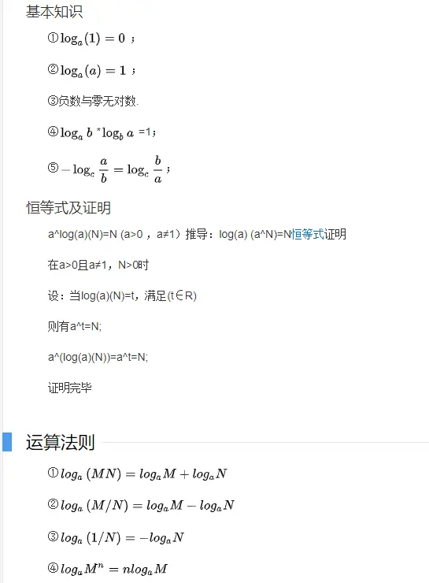

# js常用算法
## 对数
如果a^x=N(a>0,且a≠1)，则x叫做以a为底N的对数,记做x=log(a)(N)，其中a要写于log右下。其中a叫做对数的底，N叫做真数 。通常我们将以10为底的对数叫做常用对数，以e为底的对数称为自然对数。

`「基本知识」`：


### 时间复杂度
通常我们会用大O来表示一个算法的时间复杂度，即 某个算法的时间增量。

例如： 要在 一个 5个元素的数组中 查找 1个数 ， 不管从第几个元素开始查找 要想 找到这个数 ，最多需要 5次查找操作 ，最少需要1次 如果是 6个元素的数组，要找到这个数 则 最多 6次 ，最少1次。 通过 大O表示 时间复杂度就是 O(n), 即 每增加 n个元素 就需要 多查找n次 ，算法的时间增量就是o(n).通常大O表示算法复杂度增量 都是以 最坏的 情况为 准。

### 简单查找
在一个数组中挨个查找某个数据，这种查找就是简单查找

比如 5个元素的数组中 查找 1个数 ，从头到尾查找，最多需要查找五次。

`「时间复杂度」`：O(n) , 算法时间是线性增长的。 n个数 最多查找n次 最少查找1次。

`「例子」`：
```js
/*
   * 简单查找
   * @param arr 目标数组
   * @param num 要查找的数字
   */
  function simpleSearch(arr: number[], num: number):number {
    for (let one of arr) {
      if (one === num) {
        return one;
      }
    }
    return -1;
  }
  ```
### 二分查找
`「前提」`：已经排序的数据

`「逻辑」`：在排好序（降序如 1,2,3）的 容器中 每次选择 容器的 中间或者+1或者-1的数字，进行比较，如果 该数字 大于要查找的数字 ，那么以该数字索引-1对应的值为最大元素，以原来最小的值为最小值 ，继续 折中 查找，如果 该数字 小于要查找的数字 则以 该数字索引+1所对应的值为最小值 ，原最大值为最大值 再次折中查找 ，一直到最小数索引等于最大数索引 即 找到对应的值或者 查找完 没有该值为止。

`「时间复杂度」`：O(log2n) 以2为底 真数为n的对数。

比如 在 n个已经排好序的数中查找某个数据，每次折中查找 ，那么找到这个数的 最多次数是 log2n 次 。如果 n是 10 那么 找到这个数 最多需要4次 即 2 * 2 * 2 * 2。因为222是 8不到10 不能完全查完容器的数据，所以还需要折中查找一次，所以是 4次

`「例子」`：
```js
/*
   * arr 目标数组
   * num  要查找的数字
  */
 function binarySearch(arr: number[], num: number):number {
    let low = 0;
    let hight = arr.length - 1;
    let count = 0;
    while (low <= hight) {
      count++;
      let mid = Math.floor((low + hight) / 2);
      let guess = arr[mid];
      if (guess === num) return guess;
      if (guess > num) {
        hight = mid - 1;
      } else {
        low = mid + 1;
      }
    }
    return -1;
  }
  ```
### 选择排序
`「逻辑」`：需要遍历n-1趟，n表示容器中n个元素，每趟从待排序的记录序列中选择最小或最大的数字放到已排序表的最前位置，直到全部排完。 每趟交换一次数据

`「时间复杂度」`：log(n*n) 最多需要 n * n 次排完

`「稳定性」`：不稳定

`「例子」`：
```js
/*
   * 选择排序 从小到大
   * @param arr 容器
   */
 function selectionSort(arr: number[]) {
    let len = arr.length;
    for (let i = 0; i < len - 1 ; i++) {
      //设定第一个元素为最小元素
      let minindex = i;
      for (let j = i + 1; j < len ; j++) {
        if (arr[minindex] > arr[j]) {
          minindex = j;
        }
      }
      //每次遍历找出最小值与上一次的最小值交换
      if (i != minindex) {
        let temp = arr[minindex];
        arr[minindex] = arr[i];
        arr[i] = temp;
      }

    }
  }
  ```
### 冒泡排序
`「逻辑」`：在要排序的一组数中，对当前还未排好序的范围内的全部数，对相邻的两个数依次进行比较和调整，让较大的数往下沉，较小的往上冒。即：每当两相邻的数比较后发现它们的排序与排序要求相反时，就将它们互换。 需要遍历 n-1趟，每趟 需要对比 n- 当前排序索引-1 次。每趟 交换 n-当前排序索引 -1次 数据

`「时间复杂度」`：log(n*n) 最多需要 n * n 次排完

`「稳定性」`：稳定

`「例子」`：
```js
/*
 * 冒泡排序 从小到大
 * @param arr 
 */
 function bubbleSort(arr: number[]) {
    let len = arr.length;
    for (let i = 0; i < len - 1; i++) {
      for (let j = 0; j < len - i - 1; j++) { // -i 是 排除已经沉到最下面的数，没必要再次比较。
        if (arr[j] > arr[j + 1]) {
          let temp = arr[j];
          arr[j] = arr[j + 1];
          arr[j + 1] = temp;
        }
      }
    }
  }
  ```
### 快速排序
`「逻辑」`：

(1)首先设定一个分界值，通过该分界值将数组分成左右两部分。

(2)将大于或等于分界值的数据集中到数组右边，小于分界值的数据集中到数组的左边。此时，左边部分中各元素都小于或等于分界值，而右边部分中各元素都大于或等于分界值。

(3)然后，左边和右边的数据可以独立排序。对于左侧的数组数据，又可以取一个分界值，将该部分数据分成左右两部分，同样在左边放置较小值，右边放置较大值。右侧的数组数据也可以做类似处理。

(4)重复上述过程，可以看出，这是一个递归定义。通过递归将左侧部分排好序后，再递归排好右侧部分的顺序。当左、右两个部分各数据排序完成后，整个数组的排序也就完成了。

`「时间复杂度」`：最好情况 nlog(2n),最差情况log(n*n)

`「理想的情况是」`：每次划分所选择的中间数恰好将当前序列几乎等分，经过log2n趟划分，便可得到长度为1的子表。这样，整个算法的时间复杂度为O(nlog2n)。

`「最坏的情况是」`：每次所选的中间数是当前序列中的最大或最小元素，这使得每次划分所得的子表中一个为空表，另一子表的长度为原表的长度-1。这样，长度为n的数据表的快速排序需要经过n趟划分，使得整个排序算法的时间复杂度为O(n*n)

`「稳定性」`：不稳定

`「例子」`：
```js
/*
   * 快速排序
   * @param array 输入待排序数组
   * @returns 排序后的数组
   */
  quickSort(array:number[]) {

    const sort = (arr, left = 0, right = arr.length - 1) => {
     if (left >= right) {//如果左边的索引大于等于右边的索引说明整理完毕
      return
      }

    let low = left
    let index = right
    const baseVal = arr[right] // 取无序数组最后一个数为基准值

    while (low < index) {//把所有比基准值小的数放在左边大的数放在右边

      //找到一个比基准值大的数交换
      while (low < index && arr[low] <= baseVal) { 
        low++
      }
      arr[index] = arr[low] // 将较大的值放在右边如果没有比基准值大的数就是将自己赋值给自己（i 等于 j）

      while (low < index && arr[index] >= baseVal) { //找到一个比基准值小的数交换
        index--
        break
      }
      arr[low] = arr[index] // 将较小的值放在左边如果没有找到比基准值小的数就是将自己赋值给自己（i 等于 j）
    }

      arr[index] = baseVal // 将基准值放至中央位置完成一次循环（这时候 j 等于 i ）

      sort(arr, left, index-1) // 将左边的无序数组重复上面的操作
      sort(arr, index+1, right) // 将右边的无序数组重复上面的操作
    }
    sort(array)
    return array
   }
   ```