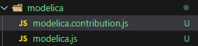
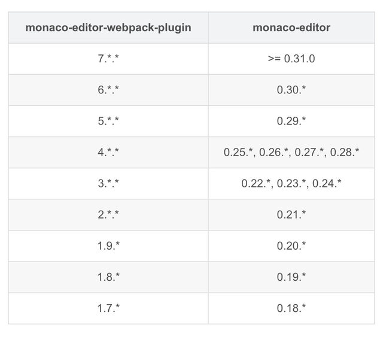
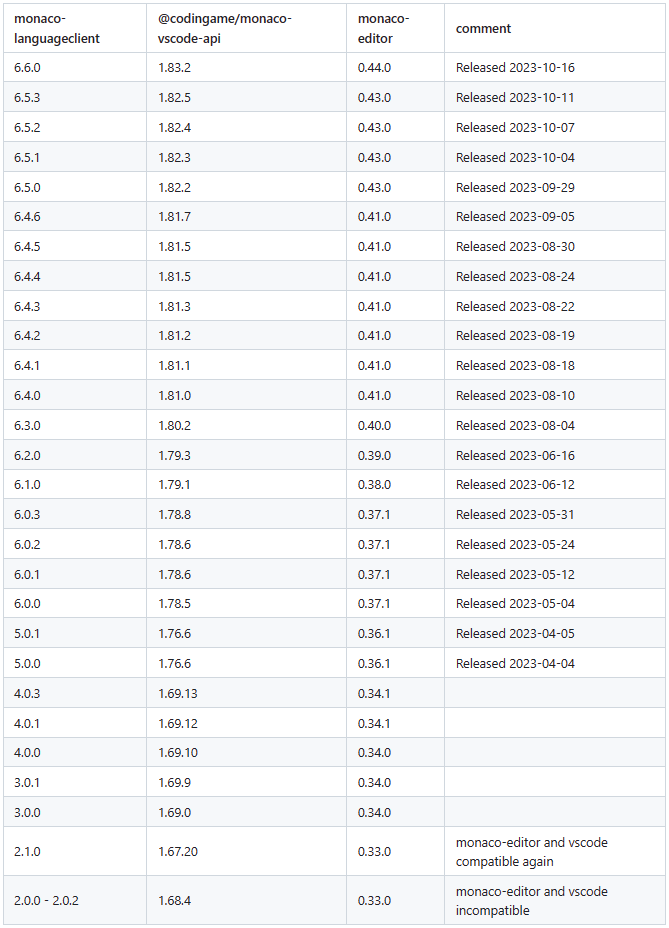

### 1. vue3可行版本
##### 1. package.json配置
```js
// vue3
"dependencies": {
    "monaco-editor": "^0.33.0",
    "monaco-languageclient": "^2.1.0",
    "vscode-ws-jsonrpc": "^1.0.2",
  },
  ```
##### 2. 简单实现 
```js
<template>
  <div class="monaco-editor-container" style="width: 100%; height: 100%;" ref="editorContainer"/>
</template>

<script lang="ts" setup>
import { defineEmits, defineExpose, defineProps, onMounted, onUnmounted, ref, shallowRef, watch } from 'vue'

import * as monaco from 'monaco-editor'
import * as common from './common'

import type { MessageTransports } from 'monaco-languageclient';
import { CloseAction, ErrorAction, MonacoLanguageClient, MonacoServices } from 'monaco-languageclient'
import { WebSocketMessageReader, WebSocketMessageWriter, toSocket } from 'vscode-ws-jsonrpc'

const props = defineProps<{
    editorOption: monaco.editor.IStandaloneEditorConstructionOptions,
}>()

const editor = shallowRef<monaco.editor.IStandaloneCodeEditor | null>(null)

const editorContainer = ref<HTMLElement | null>(null)

watch(() => props.editorOption, (val : monaco.editor.IStandaloneEditorConstructionOptions) => {
  console.log(val)
  editor.value?.updateOptions(val)
}, { deep: true })

function setModel (model : monaco.editor.ITextModel) {
  editor.value?.setModel(model)
}
function getAllDecorationbyClass (className : string) {
  return editor.value?.getModel()?.getAllDecorations()
    .filter(decoration => decoration.options.glyphMarginClassName === className)
}

function clearAllDecorationbyClass (className: string) {
  const decorations = getAllDecorationbyClass(className)?.map(decoration => decoration.id)
  if (decorations) {
    editor.value?.getModel()?.deltaDecorations(decorations, [])
  }
}

function existDecoration (className: string, lineNumber: number) {
  return getAllDecorationbyClass(className)?.some(decoration => decoration.range.startLineNumber === lineNumber)
}

function addDecoration (className: string, lineNumber: number, hoverMessage: string) {
  const old = getAllDecorationbyClass(className) as monaco.editor.IModelDecoration[]
  const oldId = old.map(decoration => decoration.id)
  const existIndex = old.findIndex(decoration => decoration.range.startLineNumber === lineNumber)
  // doesn't exist a decoration on the line
  if (existIndex === -1) {
    old.push({
      id: '',
      ownerId: 0,
      range: new monaco.Range(lineNumber, 1, lineNumber, 1),
      options: {
        isWholeLine: true,
        glyphMarginClassName: className,
        stickiness: monaco.editor.TrackedRangeStickiness.NeverGrowsWhenTypingAtEdges,
        glyphMarginHoverMessage: {
          value: hoverMessage
        }
      }
    })
    editor.value?.getModel()?.deltaDecorations(oldId, old)
  }
}

function removeDecoration (className: string, lineNumber: number) {
  const old = getAllDecorationbyClass(className) as monaco.editor.IModelDecoration[]
  const oldId = old.map(decoration => decoration.id)
  const existIndex = old.findIndex(decoration => decoration.range.startLineNumber === lineNumber)
  // exist a decoration on the line
  if (existIndex !== -1) {
    old.splice(existIndex, 1)
    editor.value?.getModel()?.deltaDecorations(oldId, old)
  }
}

function createLanguageClient (transports: MessageTransports): MonacoLanguageClient {
  return new MonacoLanguageClient({
    name: 'Sample Language Client',
    clientOptions: {
      // use a language id as a document selector
      documentSelector: ['python'],
      // disable the default error handler
      errorHandler: {
        error: () => ({ action: ErrorAction.Continue }),
        closed: () => ({ action: CloseAction.DoNotRestart })
      }
    },
    // create a language client connection from the JSON RPC connection on demand
    connectionProvider: {
      get: () => {
        return Promise.resolve(transports)
      }
    }
  })
}

const createUrl = (hostname: string, port: number, path: string, searchParams: Record<string, any> = {}, secure: boolean = location.protocol === 'https:'): string => {
    const protocol = secure ? 'wss' : 'ws';
    const url = new URL(`${protocol}://${hostname}:${port}${path}`);

    for (let [key, value] of Object.entries(searchParams)) {
        if (Array.isArray(value)) {
            value = value.join(',');
        }
        if (value) {
            url.searchParams.set(key, value);
        }
    }

    return url.toString();
};

onMounted(() => {
  // StandaloneServices.initialize({
  //   ...getMessageServiceOverride(document.body)
  // })
  // buildWorkerDefinition('dist', new URL('', window.location.href).href, false)

  console.log('Monaco Editor mounted')
  if (editorContainer.value !== null && props.editorOption !== null) {
    editor.value = monaco.editor.create(editorContainer.value, props.editorOption)
    console.log('editor.value', props.editorOption)
  } else {
    console.error('editor container is null')
  }

  // create save and modify emitter
  editor.value?.onDidChangeModelContent(() => {
    emit('modified')
  })

  editor.value?.addAction({
    // An unique identifier of the contributed action.
    id: 'save-current-file',

    // A label of the action that will be presented to the user.
    label: 'Save',

    // An optional array of keybindings for the action.
    keybindings: [
      monaco.KeyMod.CtrlCmd | monaco.KeyCode.KeyS
    ],

    // A precondition for this action.
    precondition: undefined,

    // A rule to evaluate on top of the precondition in order to dispatch the keybindings.
    keybindingContext: undefined,

    contextMenuGroupId: 'navigation',

    contextMenuOrder: 1.5,

    // Method that will be executed when the action is triggered.
    // @param editor The editor instance is passed in as a convenience
    run () {
      emit('saved')
    }
  })

  editor.value?.onDidFocusEditorText(() => {
    emit('changeCursorFocus')
  })

  // for lint service
  // install the service
  MonacoServices.install()

  // create websocket
  const url = createUrl('localhost', 30000, '/pyright', {
        // Used to parse an auth token or additional parameters such as import IDs to the language server
        authorization: 'UserAuth'
        // By commenting above line out and commenting below line in, connection to language server will be denied.
        // authorization: 'FailedUserAuth'
    }, false)
  const webSocket = new WebSocket(url)

  // define the connection(websocket) to the language server
  webSocket.onopen = () => {
    const socket = toSocket(webSocket)
    const reader = new WebSocketMessageReader(socket)
    const writer = new WebSocketMessageWriter(socket)
    const languageClient = createLanguageClient({ reader, writer })
    languageClient.start()
    reader.onClose(() => languageClient.stop())
  }

  // set shadow on move
  editor.value?.onMouseMove(e => {
    const { target } = e
    if (target.type === monaco.editor.MouseTargetType.GUTTER_GLYPH_MARGIN ||
      target.type === monaco.editor.MouseTargetType.GUTTER_LINE_DECORATIONS) {
      if (!existDecoration(common.breakPointClassName, target.position.lineNumber)) {
        clearAllDecorationbyClass(common.shadowBreakpointClassName)
        addDecoration(common.shadowBreakpointClassName, target.position.lineNumber, '')
      }
    } else {
      clearAllDecorationbyClass(common.shadowBreakpointClassName)
    }
  })
  // clear shadow on leave
  editor.value?.onMouseLeave(() => {
    clearAllDecorationbyClass(common.shadowBreakpointClassName)
  })
  // set breakpoint property to the editor
  editor.value?.onMouseDown(e => {
    const { target } = e
    if (target.type === monaco.editor.MouseTargetType.GUTTER_GLYPH_MARGIN || target.type === monaco.editor.MouseTargetType.GUTTER_LINE_DECORATIONS) {
      clearAllDecorationbyClass(common.shadowBreakpointClassName)
      if (!existDecoration(common.breakPointClassName, target.position.lineNumber)) {
        addDecoration(common.breakPointClassName, target.position.lineNumber, '')
      } else {
        removeDecoration(common.shadowBreakpointClassName, target.range.startLineNumber)
        removeDecoration(common.breakPointClassName, target.position.lineNumber)
      }
    }
  })
})

function locateToLine (lineNumber: number) {
  // console error when lineNumber is not valid
  const lineCount = editor.value?.getModel()?.getLineCount() as number
  if (lineNumber < 1 || lineNumber > lineCount) {
    console.error('line number is not valid')
  }
  editor.value?.revealLineInCenter(lineNumber)
  editor.value?.setPosition({ lineNumber, column: 1 })
}

onUnmounted(() => {
  console.log('Monaco Editor Destroyed')
  editor.value?.dispose()
})

defineExpose({
  setModel,
  locateToLine
})

const emit = defineEmits<{
  (e: 'modified'): void
  (e: 'saved'): void
  (e: 'splitCurrentView', direction: 'horizontal' | 'vertical'): void
  (e: 'changeCursorFocus'): void
}> ()
</script>
```
### 2. vue2可行版本
##### 1. package.json配置
```js
"dependencies": {
    "monaco-editor": "^0.20.0",
    "monaco-editor-webpack-plugin": "^1.9.1",
    "monaco-languageclient": "^0.13.0",
    "vscode-ws-jsonrpc": "^0.2.0",
  },
  ```
##### 2. vue.config.js配置
```js
const path = require('path');
const MonacoWebpackPlugin = require('monaco-editor-webpack-plugin');
  chainWebpack: config => {
    config.resolve.alias
      .set(
        'vscode',
        path.resolve(
          './node_modules/monaco-languageclient/lib/vscode-compatibility'
        )
      );
    config.plugin('MonacoWebpackPlugin').use(MonacoWebpackPlugin, [
      {
        languages: ['javascript', 'python'],
        features: ['coreCommands', 'find']
      }
    ]);
  },
  ```
##### 3. 简单实现
```js
<template>
  <div id="editor" style="width: 100%; height: 100%"></div>
</template>

<script>
import { listen } from 'vscode-ws-jsonrpc';
import * as monaco from 'monaco-editor';
// import 'monaco-editor/esm/vs/basic-languages/python/python.contribution'; // 如果默认不高亮，引入后python语言高亮
// import 'monaco-editor/esm/vs/basic-languages/monaco.contribution'; // 如果默认不高亮，引入后所有支持的语言高亮（包括python）
import {
  createConnection,
  CloseAction,
  ErrorAction,
  MonacoLanguageClient,
  MonacoServices
} from 'monaco-languageclient';

export default {
  name: 'Editor',
  data() {
    return {
      editor: null,
      value: 'print("hello")'
    };
  },
  mounted() {
    this.$nextTick(() => {
      const editorOptions = {
        value: this.value,
        theme: 'vs-dark',
        glyphMargin: true,
        // language: 'javascript',
        language: 'python',
        automaticLayout: true,
        bracketPairColorization: true,

        lightbulb: {
          enabled: true
        },
        minimap: { enabled: false }
      };
      this.editor = monaco.editor.create(
        document.getElementById('editor'),
        editorOptions
      );

      MonacoServices.install(this.editor);
      this.connectToLangServer();
    });
  },
  methods: {
    createLanguageClient: function (connection) {
      return new MonacoLanguageClient({
        name: 'Monaco language client',
        clientOptions: {
          documentSelector: ['python'],
          errorHandler: {
            error: () => ErrorAction.Continue,
            closed: () => CloseAction.Restart
          }
        },

        connectionProvider: {
          get: (errorHandler, closeHandler) => {
            return Promise.resolve(
              createConnection(connection, errorHandler, closeHandler)
            );
          }
        }
      });
    },
    connectToLangServer: function () {
      const webSocket = new WebSocket(
        this.createUrl(
          'localhost',
          30000,
          '/pyright',
          {
            // Used to parse an auth token or additional parameters such as import IDs to the language server
            authorization: 'UserAuth'
            // By commenting above line out and commenting below line in, connection to language server will be denied.
            // authorization: 'FailedUserAuth'
          },
          false
        )
      );

      listen({
        webSocket: webSocket,
        onConnection: connection => {
          var languageClient = this.createLanguageClient(connection);
          var disposable = languageClient.start();

          connection.onClose(function () {
            return disposable.dispose();
          });

          connection.onError(function (error) {
            console.log('Error===>>>>', error);
          });
        }
      });
    },
    createUrl(
      hostname,
      port,
      path,
      searchParams = {},
      secure = window.location.protocol === 'https:'
    ) {
      const protocol = secure ? 'wss' : 'ws';
      const url = new URL(`${protocol}://${hostname}:${port}${path}`);

      for (let [key, value] of Object.entries(searchParams)) {
        if (value instanceof Array) {
          value = value.join(',');
        }
        if (value) {
          url.searchParams.set(key, value);
        }
      }

      return url.toString();
    }
  }
};
</script>
```
### 3. vue2可行版本(该版本使用了额外的@monaco-editor/loader)
##### 1. package.json配置
```js
"dependencies": {
    "@monaco-editor/loader": "^1.2.0",
    "monaco-editor": "^0.32.1",
    "monaco-editor-webpack-plugin": "^7.1.0",
    "monaco-languageclient": "^0.13.0",
    "vscode-ws-jsonrpc": "^0.2.0",
  },
  ```
##### 2. vue.config.js配置
```js
const path = require('path');
const MonacoWebpackPlugin = require('monaco-editor-webpack-plugin');
  chainWebpack: config => {
    config.resolve.alias
      .set(
        'vscode',
        path.resolve(
          './node_modules/monaco-languageclient/lib/vscode-compatibility'
        )
      );
    config.plugin('MonacoWebpackPlugin').use(MonacoWebpackPlugin, [
      {
        languages: ['javascript', 'python'],
        features: ['coreCommands', 'find']
      }
    ]);
  },
```
##### 3. 简单实现
```js
<template>
  <div id="editor" style="width: 500px; height: 500px"></div>
</template>

<script>
import { listen } from "vscode-ws-jsonrpc";

import {
  MonacoLanguageClient,
  CloseAction,
  ErrorAction,
  createConnection,
  MonacoServices,
} from "monaco-languageclient";

import loader from "@monaco-editor/loader";

export default {
  name: "Editor",
  async mounted() {
    loader.init().then((monaco) => {
      const editorOptions = {
        // language: "python",
        theme: "vs-dark",
        glyphMargin: true,
        language: "python",
        automaticLayout: true,
        bracketPairColorization: true,

        lightbulb: {
          enabled: true,
        },
        minimap: { enabled: false },
      };

      monaco.editor.create(document.getElementById("editor"), editorOptions);

      MonacoServices.install(monaco);
      this.connectToLangServer();
    });
  },
  methods: {
    createLanguageClient: function (connection) {
      return new MonacoLanguageClient({
        name: "Monaco language client",
        clientOptions: {
          documentSelector: ["python"],
          errorHandler: {
            error: () => ErrorAction.Continue,
            closed: () => CloseAction.Restart,
          },
        },

        connectionProvider: {
          get: (errorHandler, closeHandler) => {
            return Promise.resolve(
              createConnection(connection, errorHandler, closeHandler)
            );
          },
        },
      });
    },
    connectToLangServer: function () {
      const webSocket = new WebSocket(
        this.createUrl(
          "localhost",
          30000,
          "/pyright",
          {
            // Used to parse an auth token or additional parameters such as import IDs to the language server
            authorization: "UserAuth",
            // By commenting above line out and commenting below line in, connection to language server will be denied.
            // authorization: 'FailedUserAuth'
          },
          false
        )
      );

      listen({
        webSocket: webSocket,
        onConnection: (connection) => {
          var languageClient = this.createLanguageClient(connection);
          var disposable = languageClient.start();

          connection.onClose(function () {
            return disposable.dispose();
          });

          connection.onError(function (error) {
            console.log(error);
          });
        },
      });
    },
    createUrl(
      hostname,
      port,
      path,
      searchParams = {},
      secure = window.location.protocol === "https:"
    ) {
      const protocol = secure ? "wss" : "ws";
      const url = new URL(`${protocol}://${hostname}:${port}${path}`);

      for (let [key, value] of Object.entries(searchParams)) {
        if (value instanceof Array) {
          value = value.join(",");
        }
        if (value) {
          url.searchParams.set(key, value);
        }
      }

      return url.toString();
    },
  },
};
</script>
```

### 4. 新语言的高亮
参考node_modules\monaco-editor\esm\vs\basic-languages中的语言格式
我们创建一个modelica语言，目录格式为：

```js
// modelica.contribution.js
'use strict';
import { registerLanguage } from 'monaco-editor/esm/vs/basic-languages/_.contribution.js';
registerLanguage({
  id: 'modelica',
  extensions: ['.mo', '.moe'],
  aliases: ['modelica', 'mo'],
  firstLine: '^#!/.*\\bmodelica[0-9.-]*\\b',
  loader: function () {
    return import('./modelica');
  }
});
```
modelica.js则是具体高亮的关键字配置

#### 注：
 #### monaco-editor 的版本与 monaco-editor-webpack-plugin 的版本对应关系

 #### monaco-editor 的版本与 monaco-languageclient 的版本对应关系
`下表描述了哪个版本的monaco-languageclient和@codingame/monaco-vscode-api与特定版本的monaco-editor兼容。该列表从版本 2.0.0 开始，因为首次引入了 @codingame/monaco-vscode-api。`

###### monaco-editor 创建时的配置（每个版本可能都有一些不同，详细的对照相应版本的安装包中的TS文件进行查看）
| 参数 | 说明 | 类型 | 可选值 | 默认值 |
|-|-|-|-|-| 
| model | 与此代码编辑器关联的初始模型。 | ITextModel \| null | -- | -- |
| value | 编辑器中自动创建的模型的初始值。若要不自动创建模型,请使用"model:null"。| string | -- | -- |
| language | 编辑器中自动创建的模型的初始语言。若要不自动创建模型,请使用"model:null"。| string | -- | -- |
| theme | 用于渲染的初始主题。当前开箱即用的主题是:"vs"(默认)、"vs-dark"、"hc-black"。您可以通过`monaco.editor.defineTheme`创建自定义主题。要切换主题,请使用`monaco.editor.setTheme` | string | -- | "vs" |
| accessibilityHelpUrl | 按下Ctrl+H(Windows和Linux)或Cmd+H(OSX)时打开的URL编辑器中的辅助功能帮助对话框。Defaults to "<https://go.microsoft.com/fwlink/?linkid=852450>" | string | -- | "<https://go.microsoft.com/fwlink/?linkid=852450>" |  
| dimension | 初始编辑器尺寸(以避免测量容器)interface IDimension {<br/>width: number;<br/>height: number;<br/>} | IDimension | -- | -- |
| inDiffEditor | 这个编辑器在diff编辑器中使用 | boolean | -- | false |
| ariaLabel | 编辑器文本区域的aria标签(当它被聚焦时). | string | -- | -- |
| rulers | 在指定的列处渲染垂直线。默认为空数组。 | number[] | -- | [] |
| wordSeparators | 包含单词导航时使用的单词分隔符的字符串。Defaults to ~!@#$%^&*()-=+[{]}\\|;:\'",.<>/? | string | -- | ~!@#$%^&*()-=+[{]}\\|;:\'",.<>/?` |
| selectionClipboard | 启用Linux主剪贴板 Defaults to true. | boolean | -- | true | 
| lineNumbers | 控制行号的渲染。如果它是一个函数,则在呈现行号时会调用它,并呈现返回值。否则,如果它是true,则行号将正常呈现(相当于使用身份函数)。否则,将不会渲染行号。 Defaults to on.<br><br>type LineNumbersType = 'on' \| 'off' \| 'relative' \| 'interval' \| ((lineNumber: number) => string); | LineNumbersType | -- | "on" |
| cursorSurroundingLines | 控制光标周围可见的前导线和尾随线的最小数量。Defaults to 0. | number | -- | 0 | 
| cursorSurroundingLinesStyle | 控制何时应强制执行"cursorSurroundingLines"默认值为"default",更改光标位置时不强制执行"cursorSurroundingLines"通过鼠标。 | 'default' \| 'all' | -- | "default" |
| renderFinalNewline | 当文件以换行符结束时,渲染最后一个行号。Defaults to true. | boolean | -- | true |
| selectOnLineNumbers | 单击行号时是否应选择相应的行?Defaults to true. | boolean | -- | true |
| lineNumbersMinChars | 通过保留用于呈现至少一定数量的数字的水平空间来控制行号的宽度。Defaults to 5. | number | -- | 5 | 
| glyphMargin | Enable the rendering of the glyph margin.(启用图示符边距的渲染。)Defaults to true in vscode and to false in monaco-editor. | boolean | -- | true |
| lineDecorationsWidth | 为线条装饰保留的宽度(以px为单位)。线条装饰放置在行号和编辑器内容之间。您可以传入一个字符串,格式为浮点,后跟“ch”。例如1.3ch。Defaults to 10. | number \| string | - | 10 |
| revealHorizontalRightPadding | 当显示光标时,会在光标上添加一个虚拟填充(px),将其变成一个矩形。此虚拟填充可确保光标在碰到视口边缘之前显示出来。Defaults to 30 (px). | number | - | 30 |
| roundedSelection | 使用圆角边框渲染编辑器选择。Defaults to true. | boolean | - | true | 
| extraEditorClassName | Class name to be added to the editor.(要添加到编辑器中的类名。) | string | - | - |
| readOnly | Should the editor be read only.(编辑器是否只读。)Defaults to false. | boolean | - | false |
| renderValidationDecorations | Should the editor render validation decorations.(编辑器是否应该渲染验证装饰。)Defaults to editable. | 'editable' \| 'on' \| 'off' | - | 'editable' |
| scrollbar | Control the behavior and rendering of the scrollbars.(控制滚动条的行为和呈现)| IEditorScrollbarOptions | - | - |
| minimap | Control the behavior and rendering of the minimap.(控制小地图的行为和渲染。)| IEditorMinimapOptions | - | - | 
| find | Control the behavior of the find widget.(控制查找小部件的行为。)| IEditorFindOptions | - | - |
| fixedOverflowWidgets | Display overflow widgets as fixed.(将溢出小部件显示为`fixed`)Defaults to false. | boolean | - | false |
| overviewRulerLanes | The number of vertical lanes the overview ruler should render.(概览标尺应渲染的垂直车道数。)Defaults to 3. | number | - | 3 |
| overviewRulerBorder | Controls if a border should be drawn around the overview ruler.(控制是否应围绕概览标尺绘制边框)Defaults to true. | boolean | - | true |
| cursorBlinking | Control the cursor animation style, possible values are 'blink', 'smooth', 'phase', 'expand' and 'solid'.(控制光标动画样式,可能的值为“闪烁”、“平滑”、“相位”、“展开”和“实心”。)Defaults to 'blink'. | 'blink' \| 'smooth' \| 'phase' \| 'expand' \| 'solid' | - | 'blink' |
| mouseWheelZoom | Zoom the font in the editor when using the mouse wheel in combination with holding Ctrl.(使用鼠标滚轮并按住Ctrl键时,可以在编辑器中缩放字体。)Defaults to false. | boolean | - | false | 
| mouseStyle | Control the mouse pointer style, either 'text' or 'default' or 'copy'(控制鼠标指针样式,“text”或“default”或“copy”) Defaults to 'text' | 'text' \| 'default' \| 'copy' | - | 'text' |
| cursorSmoothCaretAnimation | Enable smooth caret animation.(启用平滑插入符号动画。) Defaults to false. | boolean | - | false |
| cursorStyle | Control the cursor style, either 'block' or 'line'.(控制光标样式,“块”或“线”。) Defaults to 'line'. | 'line' \| 'block' \| 'underline' \| 'line-thin' \| 'block-outline' \| 'underline-thin' | - | 'line' |
| cursorWidth | Control the width of the cursor when cursorStyle is set to 'line'(当cursorStyle设置为“line”时控制光标的宽度) | number | - | - |
| fontLigatures | Enable font ligatures.(启用字体连字) Defaults to false. | boolean \| string | - | false |
| disableLayerHinting | 禁用编辑器页边距和行图层的“transform:translate3d(0px,0px,0px)”。“transform:translate3d(0px,0px,0px)”的用法为浏览器创建额外的层提供了提示。Defaults to false. | boolean | - | false |
| disableMonospaceOptimizations | Disable the optimizations for monospace fonts.(禁用对单空间字体的优化。) Defaults to false. | boolean | - | false | 
| hideCursorInOverviewRuler | Should the cursor be hidden in the overview ruler.(光标是否应隐藏在概览标尺中) Defaults to false. | boolean | - | false |
| scrollBeyondLastLine | Enable that scrolling can go one screen size after the last line.(启用滚动可以在最后一行之后移动一个屏幕大小) Defaults to true. | boolean | - | true |
| scrollBeyondLastColumn | Enable that scrolling can go beyond the last column by a number of columns.(启用滚动可以超出最后一列若干列) Defaults to 5. | number | - | 5 |
| smoothScrolling | Enable that the editor animates scrolling to a position.(启用编辑器为滚动到某个位置设置动画。) Defaults to false. | boolean | - | false |
| automaticLayout | 启用编辑器将安装一个间隔来检查其容器dom节点大小是否已更改。启用此功能可能会对性能产生严重影响。Defaults to false. | boolean | - | false |
| wordWrap | 控制编辑器的换行。When wordWrap = "off", the lines will never wrap. When wordWrap = "on", the lines will wrap at the viewport width. When wordWrap = "wordWrapColumn", the lines will wrap at wordWrapColumn. When wordWrap = "bounded", the lines will wrap at min(viewport width, wordWrapColumn). Defaults to "off". | 'off' \| 'on' \| 'wordWrapColumn' \| 'bounded' | - | 'off' |
| wordWrapColumn | 控制编辑器的换行。When wordWrap = "off", the lines will never wrap. When wordWrap = "on", the lines will wrap at the viewport width. When wordWrap = "wordWrapColumn", the lines will wrap at wordWrapColumn. When wordWrap = "bounded", the lines will wrap at min(viewport width, wordWrapColumn). Defaults to 80. | number | - | 80 |
| wordWrapMinified | Force word wrapping when the text appears to be of a minified/generated file.(当文本显示为缩小/生成的文件时,强制换行。) Defaults to true. | boolean | - | true |
| wrappingIndent | Control indentation of wrapped lines. Can be: 'none', 'same', 'indent' or 'deepIndent'.(控制换行的缩进。可以是:“none”、“same”、“indent”或“deepIndent”。) Defaults to 'same' in vscode and to 'none' in monaco-editor. | 'none' \| 'same' \| 'indent' \| 'deepIndent' | - | 'same' \| 'none' |
| wrappingStrategy | Controls the wrapping strategy to use.(控制要使用的包装策略。) Defaults to 'simple'. | 'simple' \| 'advanced' | - | 'simple' |
| wordWrapBreakBeforeCharacters | Configure word wrapping characters. A break will be introduced before these characters.(配置换行字符。在这些字符之前将引入一个break。) Defaults to '([{‘“〈《「『【〔([{「£¥$£¥++'. | string | - | '([{‘“〈《「『【〔([{「£¥$£¥++' |
| wordWrapBreakAfterCharacters | Configure word wrapping characters. A break will be introduced after these characters.(配置换行字符。在这些字符之后将引入一个break。) Defaults to ' \t})]?|/&.,;¢°′′′‰°C、。。、¢,.:;?!%・・ゝゞヽヾーァィゥェォッャュョヮヵヶぁぃぅぇぉっゃゅょゎゕゖㇰㇱㇲㇳㇴㇵㇶㇷㇸㇹㇺㇻㇼㇽㇾㇿ々〻ァィゥェォャュョッー”〉》」』】〕)]}」'. | string | - | ' \t})]?|/&.,;¢°′′′‰°C、。。、¢,.:;?!%・・ゝゞヽヾーァィゥェォッャュョヮヵヶぁぃぅぇぉっゃゅょゎゕゖㇰㇱㇲㇳㇴㇵㇶㇷㇸㇹㇺㇻㇼㇽㇾㇿ々〻ァィゥェォャュョッー”〉》」』】〕)]}」' |
| stopRenderingLineAfter | Performance guard: Stop rendering a line after x characters.(性能保护:停止渲染x个字符后的行。) Defaults to 10000. Use -1 to never stop rendering | number | - | 10000 |
| stopRenderingLineAfter | Performance guard: Stop rendering a line after x characters.(性能保护:停止渲染x个字符后的行。) Defaults to 10000. Use -1 to never stop rendering | number | - | 10000 |
| hover | Configure the editor's hover.(配置编辑器的悬停) | IEditorHoverOptions | - | - |
| links | Enable detecting links and making them clickable.(启用检测链接并使其可点击) Defaults to true. | boolean | - | true | 
| colorDecorators | Enable inline color decorators and color picker rendering.(启用内联颜色装饰器和颜色选择器渲染) | boolean | - | - |
| comments | Control the behaviour of comments in the editor.(控制编辑器中评论的行为。) | IEditorCommentsOptions | - | - |
| contextmenu | Enable custom contextmenu.(启用自定义上下文菜单。) Defaults to true. | boolean | - | true |
| mouseWheelScrollSensitivity | A multiplier to be used on the deltaX and deltaY of mouse wheel scroll events.(用于鼠标滚轮滚动事件的“deltaX”和“deltaY”的乘数。) Defaults to 1. | number | - | 1 |
| fastScrollSensitivity | FastScrolling mulitplier speed when pressing Alt(按Alt时快速滚动多个应用程序的速度`Alt`) Defaults to 5. | number | - | 5 |
| multiCursorModifier | The modifier to be used to add multiple cursors with the mouse.(用于使用鼠标添加多个光标的修饰符。) Defaults to 'alt' | 'ctrlCmd' \| 'alt' | - | 'alt' |
| multiCursorMergeOverlapping | Merge overlapping selections.(合并重叠的选择。) Defaults to true | boolean | - | true |
| multiCursorPaste | Configure the behaviour when pasting a text with the line count equal to the cursor count.(配置粘贴行数等于光标数的文本时的行为。) Defaults to 'spread'. | 'spread' \| 'full' | - | 'spread' |
| accessibilitySupport | Configure the editor's accessibility support.(配置编辑器的辅助功能支持。) Defaults to 'auto'. It is best to leave this to 'auto'. | 'auto' \| 'off' \| 'on' | - | 'auto' | 
| accessibilityPageSize | Controls the number of lines in the editor that can be read out by a screen reader(控制编辑器中屏幕阅读器可以读取的行数) | number | - | - |
| suggest | Suggest options.(建议选项。) | ISuggestOptions | - | - | 
| gotoLocation | 跳转到位置的选项。 | IGotoLocationOptions | - | - |
| quickSuggestions | Enable quick suggestions (shadow suggestions)(启用快速建议(阴影建议)) Defaults to true. | boolean \| IQuickSuggestionsOptions | - | true |
| quickSuggestionsDelay | Quick suggestions show delay (in ms)(快速建议显示延迟(毫秒)) Defaults to 10 (ms) | number | - | 10 | 
| parameterHints | Parameter hint options.(参数提示选项。) | IEditorParameterHintOptions | - | - |
| autoClosingBrackets | Options for auto closing brackets.(自动关闭括号的选项。) Defaults to language defined behavior. | EditorAutoClosingStrategy | 'always' \| 'languageDefined' \| 'beforeWhitespace' \| 'never' | - |
| autoClosingQuotes | Options for auto closing quotes.(自动结束引号的选项。) Defaults to language defined behavior. | EditorAutoClosingStrategy | 'always' \| 'languageDefined' \| 'beforeWhitespace' \| 'never' | - |
| autoClosingOvertype | Options for typing over closing quotes or brackets.(用于在右引号或括号上键入的选项。) | EditorAutoClosingOvertypeStrategy | 'always' \| 'auto' \| 'never' | - | 
| autoSurround | Options for auto surrounding.(自动环绕选项。) Defaults to always allowing auto surrounding. | EditorAutoSurroundStrategy | 'languageDefined' \| 'quotes' \| 'brackets' \| 'never' | - |
| autoIndent | Controls whether the editor should automatically adjust the indentation when users type, paste, move or indent lines.(控制当用户键入、粘贴、移动或缩进行时,编辑器是否应自动调整缩进。) Defaults to advanced. | 'none' \| 'keep' \| 'brackets' \| 'advanced' \| 'full' | - | 'advanced' |
| formatOnType | Enable format on type.(对类型启用格式。) Defaults to false. | boolean | - | false |
| formatOnPaste | Enable format on paste.(启用粘贴时的格式。) Defaults to false. | boolean | - | false |
| dragAndDrop | Controls if the editor should allow to move selections via drag and drop.(控制编辑器是否应允许通过拖放移动所选内容。) Defaults to false. | boolean | - | false |
| suggestOnTriggerCharacters | Enable the suggestion box to pop-up on trigger characters.(启用建议框以在触发字符时弹出) Defaults to true. | boolean | - | true |
| acceptSuggestionOnEnter | Accept suggestions on ENTER.(接受有关ENTER的建议。) Defaults to 'on'. | 'on' \| 'smart' \| 'off' | - | 'on' |
| acceptSuggestionOnCommitCharacter | Accept suggestions on provider defined characters.(接受有关提供程序定义的字符的建议。) Defaults to true. | boolean | - | true |
| snippetSuggestions | Enable snippet suggestions. Default to 'true'.(启用代码段建议。默认为“true”。)| 'top' \| 'bottom' \| 'inline' \| 'none' | - | 'top' |
| emptySelectionClipboard | Copying without a selection copies the current line.(在没有选择的情况下复制会复制当前行。) | boolean | - | - |
| copyWithSyntaxHighlighting | Syntax highlighting is copied.(语法高亮显示被复制)| boolean | - | - |
| suggestSelection | 建议的历史模式。| 'first' \| 'recentlyUsed' \| 'recentlyUsedByPrefix' | - | - |
| suggestFontSize | 建议部件的字体大小。默认为编辑器的字体大小。| number | - | - |
| suggestLineHeight | 建议部件的行高。默认为编辑器的行高。| number | - | - |
| tabCompletion | 启用标签完成。| 'on' \| 'off' \| 'onlySnippets' | - | - |
| selectionHighlight | 启用选择突出显示。默认为 true。| boolean | - | true |
| occurrencesHighlight | 启用语义出现突出显示。默认为 true。| boolean | - | true |
| codeLens | 显示代码透镜。默认为 true。| boolean | - | true |
| lightbulb | 控制代码操作灯泡的行为和渲染。| IEditorLightbulbOptions | - | - |
| codeActionsOnSaveTimeout | 运行保存操作的代码操作超时。| number | - | - | 
| folding | 启用代码折叠。默认为 true。| boolean | - | true |
| foldingStrategy | 选择折叠策略。'auto' 使用为当前文档贡献的策略,'indentation' 使用基于缩进的折叠策略。默认为 'auto'。| 'auto' \| 'indentation' | - | 'auto' |
| foldingHighlight | 启用折叠区域的突出显示。默认为 true。| boolean | - | true | 
| showFoldingControls | 控制折叠操作在沟槽中是否始终可见或在鼠标悬停时隐藏。默认为 'mouseover'。| 'always' \| 'mouseover' | - | 'mouseover' |
| matchBrackets | 启用匹配括号的突出显示。默认为 'always'。| 'never' \| 'near' \| 'always' | - | 'always' |
| renderWhitespace | 启用空格渲染。默认为 none。| 'none' \| 'boundary' \| 'selection' \| 'all' | - | 'none' |
| renderControlCharacters | 启用控制字符渲染。默认为 false。| boolean | - | false |
| renderIndentGuides | 启用缩进指南的渲染。默认为 true。| boolean | - | true |
| highlightActiveIndentGuide | 启用当前缩进指南的突出显示。默认为 true。| boolean | - | true |
| renderLineHighlight | 启用当前行突出显示的渲染。默认为 all。| 'none' \| 'gutter' \| 'line' \| 'all' | - | 'all' |
| useTabStops | 插入和删除空格遵循制表符停止位。| boolean | - | - |
| fontFamily | 字体系列| string | - | - |
| fontWeight | 字体粗细| string | - | - |
| fontSize | 字号| number | - | - |
| lineHeight | 行高| number | - | - |
| letterSpacing | 字母间距| number | - | - |
| showUnused | 控制未使用变量的淡出。| boolean | - | - |
| peekWidgetDefaultFocus | 默认是否聚焦snippets预览部件中的内联编辑器。默认为 false。| 'tree' \| 'editor' | - | 'tree' |
| tabSize | 标签等于的空格数。当`detectIndentation`开启时,根据文件内容覆盖此设置。默认为4。| number | - | 4 |
| insertSpaces | 按Tab时插入空格。当`detectIndentation`开启时,根据文件内容覆盖此设置。默认为true。| boolean | - | true |
| detectIndentation | 控制在文件打开时是否根据文件内容自动检测`tabSize`和`insertSpaces`。默认为true。| boolean | - | true |
| trimAutoWhitespace | 删除自动插入的末尾空白。默认为true。| boolean | - | true |
| largeFileOptimizations | 针对大文件进行特殊处理,禁用某些内存密集功能。默认为true。| boolean | - | true |
| wordBasedSuggestions | 控制是否基于文档中的词计算补全。默认为true。| boolean | - | true |
| stablePeek | 即使双击内容或按下`Esc`也保持预览编辑器打开。默认为false。| boolean | - | false |
| maxTokenizationLineLength | 长度超过此值的行不会被标记,以提高性能。默认为20000。| number | - | 20000 | 
###### 配置的TS注释
```js
/**
 * 与此代码编辑器关联的初始模型。
 */
 model?: ITextModel | null;
/**
 * 编辑器中自动创建的模型的初始值。
 * 若要不自动创建模型，请使用“model:null”。
*/
 value?: string;
/**
* 编辑器中自动创建的模型的初始语言。
* 若要不自动创建模型，请使用“model:null”。
*/
 language?: string;
/**
* 用于渲染的初始主题。
* 当前开箱即用的主题是：“vs”（默认）、“vs-dark”、“hc-black”。
* 您可以通过`monaco.editor.defineTheme`创建自定义主题。
* 要切换主题，请使用`monaco.editor.setTheme`
*/
 theme?: string;
/**
* 按下Ctrl+H（Windows和Linux）或Cmd+H（OSX）时打开的URL
* 编辑器中的辅助功能帮助对话框。
*
* Defaults to "https://go.microsoft.com/fwlink/?linkid=852450"
*/
 accessibilityHelpUrl?: string;
 /**
 * 初始编辑器尺寸（以避免测量容器）
 * interface IDimension {
        width: number;
        height: number;
    }
*/
 dimension?: IDimension;
 /**
 * 这个编辑器在diff编辑器中使用
*/
inDiffEditor?: boolean;
/**
 * 编辑器文本区域的aria标签（当它被聚焦时）.
 */
ariaLabel?: string;
/**
 * 在指定的列处渲染垂直线。
 * 默认为空数组。
 */
rulers?: number[];
/**
 * 包含单词导航时使用的单词分隔符的字符串。
 * Defaults to `~!@#$%^&*()-=+[{]}\\|;:\'",.<>/?
 */
wordSeparators?: string;
/**
 * 启用Linux主剪贴板
 * Defaults to true.
 */
selectionClipboard?: boolean;
/**
 * 控制行号的渲染。
 * 如果它是一个函数，则在呈现行号时会调用它，并呈现返回值。
 * 否则，如果它是true，则行号将正常呈现（相当于使用身份函数）。
 * 否则，将不会渲染行号。
 * Defaults to `on`.
 *
 * type LineNumbersType = 'on' | 'off' | 'relative' | 'interval' | ((lineNumber: number) => string);
 */
lineNumbers?: LineNumbersType;
/**
 * 控制光标周围可见的前导线和尾随线的最小数量。
 * Defaults to 0.
*/
cursorSurroundingLines?: number;
/**
 * 控制何时应强制执行“cursorSurroundingLines”
 * 默认值为“default”，更改光标位置时不强制执行“cursorSurroundingLines”
 * 通过鼠标。
*/
cursorSurroundingLinesStyle?: 'default' | 'all';
/**
 * 当文件以换行符结束时，渲染最后一个行号。
 * Defaults to true.
*/
renderFinalNewline?: boolean;
/**
 * 单击行号时是否应选择相应的行？
 * Defaults to true.
 */
selectOnLineNumbers?: boolean;
/**
 * 通过保留用于呈现至少一定数量的数字的水平空间来控制行号的宽度。
 * Defaults to 5.
 */
lineNumbersMinChars?: number;
/**
 * Enable the rendering of the glyph margin.(启用图示符边距的渲染。)
 * Defaults to true in vscode and to false in monaco-editor.
 */
glyphMargin?: boolean;
/**
 * 为线条装饰保留的宽度（以px为单位）。
 * 线条装饰放置在行号和编辑器内容之间。
 * 您可以传入一个字符串，格式为浮点，后跟“ch”。例如1.3ch。
 * Defaults to 10.
 */
lineDecorationsWidth?: number | string;
/**
 * 当显示光标时，会在光标上添加一个虚拟填充（px），将其变成一个矩形。
 * 此虚拟填充可确保光标在碰到视口边缘之前显示出来。
 * Defaults to 30 (px).
 */
revealHorizontalRightPadding?: number;
/**
 * 使用圆角边框渲染编辑器选择。
 * Defaults to true.
 */
roundedSelection?: boolean;
/**
 * Class name to be added to the editor.(要添加到编辑器中的类名。)
 */
extraEditorClassName?: string;
/**
 * Should the editor be read only.(编辑器是否只读。)
 * Defaults to false.
 */
readOnly?: boolean;
/**
 * Should the editor render validation decorations.（编辑器是否应该渲染验证装饰。）
 * Defaults to editable.
 */
renderValidationDecorations?: 'editable' | 'on' | 'off';
/**
 * Control the behavior and rendering of the scrollbars.（控制滚动条的行为和呈现）
 */
scrollbar?: IEditorScrollbarOptions;
/**
 * Control the behavior and rendering of the minimap.(控制小地图的行为和渲染。)
 */
minimap?: IEditorMinimapOptions;
/**
 * Control the behavior of the find widget.(控制查找小部件的行为。)
 */
find?: IEditorFindOptions;
/**
 * Display overflow widgets as `fixed`.(将溢出小部件显示为`fixed`)
 * Defaults to `false`.
 */
fixedOverflowWidgets?: boolean;
/**
 * The number of vertical lanes the overview ruler should render.(概览标尺应渲染的垂直车道数。)
 * Defaults to 3.
 */
overviewRulerLanes?: number;
/**
 * Controls if a border should be drawn around the overview ruler.（控制是否应围绕概览标尺绘制边框）
 * Defaults to `true`.
 */
overviewRulerBorder?: boolean;
/**
 * Control the cursor animation style, possible values are 'blink', 'smooth', 'phase', 'expand' and 'solid'.（控制光标动画样式，可能的值为“闪烁”、“平滑”、“相位”、“展开”和“实心”。）
 * Defaults to 'blink'.
 */
cursorBlinking?: 'blink' | 'smooth' | 'phase' | 'expand' | 'solid';
/**
 * Zoom the font in the editor when using the mouse wheel in combination with holding Ctrl.（使用鼠标滚轮并按住Ctrl键时，可以在编辑器中缩放字体。）
 * Defaults to false.
 */
mouseWheelZoom?: boolean;
/**
 * Control the mouse pointer style, either 'text' or 'default' or 'copy'（控制鼠标指针样式，“text”或“default”或“copy”）
 * Defaults to 'text'
 */
mouseStyle?: 'text' | 'default' | 'copy';
/**
 * Enable smooth caret animation.（启用平滑插入符号动画。）
 * Defaults to false.
 */
cursorSmoothCaretAnimation?: boolean;
/**
 * Control the cursor style, either 'block' or 'line'.（控制光标样式，“块”或“线”。）
 * Defaults to 'line'.
 */
cursorStyle?: 'line' | 'block' | 'underline' | 'line-thin' | 'block-outline' | 'underline-thin';
/**
 * Control the width of the cursor when cursorStyle is set to 'line'（当cursorStyle设置为“line”时控制光标的宽度）
 */
cursorWidth?: number;
/**
 * Enable font ligatures.（启用字体连字）
 * Defaults to false.
 */
fontLigatures?: boolean | string;
/**
 * 禁用编辑器页边距和行图层的“transform:translate3d（0px，0px，0px）”。
 * “transform:translate3d（0px，0px，0px）”的用法为浏览器创建额外的层提供了提示。
 * Defaults to false.
 */
disableLayerHinting?: boolean;
/**
 * Disable the optimizations for monospace fonts.（禁用对单空间字体的优化。）
 * Defaults to false.
 */
disableMonospaceOptimizations?: boolean;
/**
 * Should the cursor be hidden in the overview ruler.（光标是否应隐藏在概览标尺中）
 * Defaults to false.
 */
hideCursorInOverviewRuler?: boolean;
/**
 * Enable that scrolling can go one screen size after the last line.（启用滚动可以在最后一行之后移动一个屏幕大小）
 * Defaults to true.
 */
scrollBeyondLastLine?: boolean;
/**
 * Enable that scrolling can go beyond the last column by a number of columns.（启用滚动可以超出最后一列若干列）
 * Defaults to 5.
 */
scrollBeyondLastColumn?: number;
/**
 * Enable that the editor animates scrolling to a position.（启用编辑器为滚动到某个位置设置动画。）
 * Defaults to false.
 */
smoothScrolling?: boolean;
/**
 * 启用编辑器将安装一个间隔来检查其容器dom节点大小是否已更改。
 * 启用此功能可能会对性能产生严重影响。
 * Defaults to false.
 */
automaticLayout?: boolean;
/**
 * 控制编辑器的换行。
 * When `wordWrap` = "off", the lines will never wrap.
 * When `wordWrap` = "on", the lines will wrap at the viewport width.
 * When `wordWrap` = "wordWrapColumn", the lines will wrap at `wordWrapColumn`.
 * When `wordWrap` = "bounded", the lines will wrap at min(viewport width, wordWrapColumn).
 * Defaults to "off".
 */
wordWrap?: 'off' | 'on' | 'wordWrapColumn' | 'bounded';
/**
 * 控制编辑器的换行。
 * When `wordWrap` = "off", the lines will never wrap.
 * When `wordWrap` = "on", the lines will wrap at the viewport width.
 * When `wordWrap` = "wordWrapColumn", the lines will wrap at `wordWrapColumn`.
 * When `wordWrap` = "bounded", the lines will wrap at min(viewport width, wordWrapColumn).
 * Defaults to 80.
 */
wordWrapColumn?: number;
/**
 * Force word wrapping when the text appears to be of a minified/generated file.（当文本显示为缩小/生成的文件时，强制换行。）
 * Defaults to true.
 */
wordWrapMinified?: boolean;
/**
 * Control indentation of wrapped lines. Can be: 'none', 'same', 'indent' or 'deepIndent'.（控制换行的缩进。可以是：“none”、“same”、“indent”或“deepIndent”。）
 * Defaults to 'same' in vscode and to 'none' in monaco-editor.
 */
wrappingIndent?: 'none' | 'same' | 'indent' | 'deepIndent';
/**
 * Controls the wrapping strategy to use.（控制要使用的包装策略。）
 * Defaults to 'simple'.
 */
wrappingStrategy?: 'simple' | 'advanced';
/**
 * Configure word wrapping characters. A break will be introduced before these characters.（配置换行字符。在这些字符之前将引入一个break。）
 * Defaults to '([{‘“〈《「『【〔（［｛｢£¥＄￡￥+＋'.
 */
wordWrapBreakBeforeCharacters?: string;
/**
 * Configure word wrapping characters. A break will be introduced after these characters.（配置换行字符。在这些字符之后将引入一个break。）
 * Defaults to ' \t})]?|/&.,;¢°′″‰℃、。｡､￠，．：；？！％・･ゝゞヽヾーァィゥェォッャュョヮヵヶぁぃぅぇぉっゃゅょゎゕゖㇰㇱㇲㇳㇴㇵㇶㇷㇸㇹㇺㇻㇼㇽㇾㇿ々〻ｧｨｩｪｫｬｭｮｯｰ”〉》」』】〕）］｝｣'.
 */
wordWrapBreakAfterCharacters?: string;
/**
 * Performance guard: Stop rendering a line after x characters.（性能保护：停止渲染x个字符后的行。）
 * Defaults to 10000.
 * Use -1 to never stop rendering
 */
stopRenderingLineAfter?: number;
/**
 * Configure the editor's hover.（配置编辑器的悬停）
 */
hover?: IEditorHoverOptions;
/**
 * Enable detecting links and making them clickable.（启用检测链接并使其可点击）
 * Defaults to true.
 */
links?: boolean;
/**
 * Enable inline color decorators and color picker rendering.（启用内联颜色装饰器和颜色选择器渲染）
 */
colorDecorators?: boolean;
/**
 * Control the behaviour of comments in the editor.（控制编辑器中评论的行为。）
 * 
 interface IEditorCommentsOptions {
     //Insert a space after the line comment token and inside the block comments tokens.(在行注释标记后和块注释标记内插入一个空格。)
     // Defaults to true.
    insertSpace?: boolean;
 }
 */
comments?: IEditorCommentsOptions;
/**
 * Enable custom contextmenu.（启用自定义上下文菜单。）
 * Defaults to true.
 */
contextmenu?: boolean;
/**
 * A multiplier to be used on the `deltaX` and `deltaY` of mouse wheel scroll events.（用于鼠标滚轮滚动事件的“deltaX”和“deltaY”的乘数。）
 * Defaults to 1.
 */
mouseWheelScrollSensitivity?: number;
/**
 * FastScrolling mulitplier speed when pressing `Alt`（按Alt时快速滚动多个应用程序的速度`Alt`）
 * Defaults to 5.
 */
fastScrollSensitivity?: number;
/**
 * The modifier to be used to add multiple cursors with the mouse.（用于使用鼠标添加多个光标的修饰符。）
 * Defaults to 'alt'
 */
multiCursorModifier?: 'ctrlCmd' | 'alt';
/**
 * Merge overlapping selections.（合并重叠的选择。）
 * Defaults to true
 */
multiCursorMergeOverlapping?: boolean;
/**
 * Configure the behaviour when pasting a text with the line count equal to the cursor count.（配置粘贴行数等于光标数的文本时的行为。）
 * Defaults to 'spread'.
 */
multiCursorPaste?: 'spread' | 'full';
/**
 * Configure the editor's accessibility support.（配置编辑器的辅助功能支持。）
 * Defaults to 'auto'. It is best to leave this to 'auto'.
 */
accessibilitySupport?: 'auto' | 'off' | 'on';
/**
 * Controls the number of lines in the editor that can be read out by a screen reader（控制编辑器中屏幕阅读器可以读取的行数）
 */
accessibilityPageSize?: number;
/**
 * Suggest options.（建议选项。）
 */
suggest?: ISuggestOptions;
/**
 * 跳转到位置的选项。
 */
gotoLocation?: IGotoLocationOptions;
/**
 * Enable quick suggestions (shadow suggestions)（启用快速建议（阴影建议））
 * Defaults to true.
 interface IQuickSuggestionsOptions {
        other: boolean;
        comments: boolean;
        strings: boolean;
    }
 */
quickSuggestions?: boolean | IQuickSuggestionsOptions;
/**
 * Quick suggestions show delay (in ms)（快速建议显示延迟（毫秒））
 * Defaults to 10 (ms)
 */
quickSuggestionsDelay?: number;
/**
 * Parameter hint options.（参数提示选项。）
 interface IEditorParameterHintOptions {
    // Enable parameter hints.(启用参数提示。)
    // Defaults to true.
    enabled?: boolean;
    // Enable cycling of parameter hints.(参数提示的循环。)
    // Defaults to false.
    cycle?: boolean;
 }
 */
parameterHints?: IEditorParameterHintOptions;
/**
 * Options for auto closing brackets.（自动关闭括号的选项。）
 * Defaults to language defined behavior.
 *
 type EditorAutoClosingStrategy = 'always' | 'languageDefined' | 'beforeWhitespace' | 'never';
 */
autoClosingBrackets?: EditorAutoClosingStrategy;
/**
 * Options for auto closing quotes.（自动结束引号的选项。）
 * Defaults to language defined behavior.
 *
 type EditorAutoClosingStrategy = 'always' | 'languageDefined' | 'beforeWhitespace' | 'never';
 */
autoClosingQuotes?: EditorAutoClosingStrategy;
/**
 * Options for typing over closing quotes or brackets.（用于在右引号或括号上键入的选项。）
 *
 type EditorAutoClosingOvertypeStrategy = 'always' | 'auto' | 'never';
 */
autoClosingOvertype?: EditorAutoClosingOvertypeStrategy;
/**
 * Options for auto surrounding.（自动环绕选项。）
 * Defaults to always allowing auto surrounding.
 *
 type EditorAutoSurroundStrategy = 'languageDefined' | 'quotes' | 'brackets' | 'never';
 */
autoSurround?: EditorAutoSurroundStrategy;
/**
 * Controls whether the editor should automatically adjust the indentation when users type, paste, move or indent lines.（控制当用户键入、粘贴、移动或缩进行时，编辑器是否应自动调整缩进。）
 * Defaults to advanced.
 */
autoIndent?: 'none' | 'keep' | 'brackets' | 'advanced' | 'full';
/**
 * Enable format on type.（对类型启用格式。）
 * Defaults to false.
 */
formatOnType?: boolean;
/**
 * Enable format on paste.（启用粘贴时的格式。）
 * Defaults to false.
 */
formatOnPaste?: boolean;
/**
 * Controls if the editor should allow to move selections via drag and drop.（控制编辑器是否应允许通过拖放移动所选内容。）
 * Defaults to false.
 */
dragAndDrop?: boolean;
/**
 * Enable the suggestion box to pop-up on trigger characters.（启用建议框以在触发字符时弹出）
 * Defaults to true.
 */
suggestOnTriggerCharacters?: boolean;
/**
 * Accept suggestions on ENTER.（接受有关ENTER的建议。）
 * Defaults to 'on'.
 */
acceptSuggestionOnEnter?: 'on' | 'smart' | 'off';
/**
 * Accept suggestions on provider defined characters.（接受有关提供程序定义的字符的建议。）
 * Defaults to true.
 */
acceptSuggestionOnCommitCharacter?: boolean;
/**
 * Enable snippet suggestions. Default to 'true'.（启用代码段建议。默认为“true”。）
 */
snippetSuggestions?: 'top' | 'bottom' | 'inline' | 'none';
/**
 * Copying without a selection copies the current line.（在没有选择的情况下复制会复制当前行。）
 */
emptySelectionClipboard?: boolean;
/**
 * Syntax highlighting is copied.（语法高亮显示被复制）
 */
copyWithSyntaxHighlighting?: boolean;
/**
 * 建议的历史模式。
 */
suggestSelection?: 'first' | 'recentlyUsed' | 'recentlyUsedByPrefix';

/**
 * 建议部件的字体大小。
 * 默认为编辑器的字体大小。
 */
suggestFontSize?: number;

/**
 * 建议部件的行高。
 * 默认为编辑器的行高。
 */  
suggestLineHeight?: number;

/**
 * 启用标签完成。
 */
tabCompletion?: 'on' | 'off' | 'onlySnippets';

/**
 * 启用选择突出显示。
 * 默认为 true。
 */
selectionHighlight?: boolean;

/**
 * 启用语义出现突出显示。
 * 默认为 true。 
 */
occurrencesHighlight?: boolean;

/**
 * 显示代码透镜
 * 默认为 true。
 */
codeLens?: boolean;

/**
 * 控制代码操作灯泡的行为和渲染。
 interface IEditorLightbulbOptions {
    // Enable the lightbulb code action.（启用灯泡代码操作。）
    // Defaults to true.
    enabled?: boolean;
 }
 */
lightbulb?: IEditorLightbulbOptions;

/**
 * 运行保存操作的代码操作超时。
 */
codeActionsOnSaveTimeout?: number;

/**  
 * 启用代码折叠。
 * 默认为 true。
 */
folding?: boolean;

/**
 * 选择折叠策略。'auto' 使用为当前文档贡献的策略,'indentation' 使用基于缩进的折叠策略。
 * 默认为 'auto'。
 */
foldingStrategy?: 'auto' | 'indentation';

/**
 * 启用折叠区域的突出显示。
 * 默认为 true。
 */
foldingHighlight?: boolean;

/**
 * 控制折叠操作在沟槽中是否始终可见或在鼠标悬停时隐藏。
 * 默认为 'mouseover'。
 */
showFoldingControls?: 'always' | 'mouseover';

/**
 * 启用匹配括号的突出显示。  
 * 默认为 'always'。
 */
matchBrackets?: 'never' | 'near' | 'always';

/**
 * 启用空格渲染。
 * 默认为 none。
 */
renderWhitespace?: 'none' | 'boundary' | 'selection' | 'all';

/**
 * 启用控制字符渲染。
 * 默认为 false。
 */
renderControlCharacters?: boolean;

/**
 * 启用缩进指南的渲染。
 * 默认为 true。
 */
renderIndentGuides?: boolean;

/**
 * 启用当前缩进指南的突出显示。
 * 默认为 true。
 */
highlightActiveIndentGuide?: boolean;

/**
 * 启用当前行突出显示的渲染。
 * 默认为 all。
 */
renderLineHighlight?: 'none' | 'gutter' | 'line' | 'all';

/**
 * 插入和删除空格遵循制表符停止位。
 */
useTabStops?: boolean;

/**
 * 字体系列
 */
fontFamily?: string;

/**
 * 字体粗细
 */  
fontWeight?: string;

/**
 * 字号
 */
fontSize?: number;

/**
 * 行高
 */
lineHeight?: number;

/**
 * 字母间距
 */
letterSpacing?: number;

/**
 * 控制未使用变量的淡出。
 */
showUnused?: boolean;

/**
 * 默认是否聚焦snippets预览部件中的内联编辑器。
 * 默认为 false。
 */
peekWidgetDefaultFocus?: 'tree' | 'editor';
/**
 * 标签等于的空格数。
 * 当`detectIndentation`开启时,根据文件内容覆盖此设置。
 * 默认为4。
 */
tabSize?: number;

/**
 * 按Tab时插入空格。
 * 当`detectIndentation`开启时,根据文件内容覆盖此设置。
 * 默认为true。
 */
insertSpaces?: boolean;

/**
 * 控制在文件打开时是否根据文件内容自动检测`tabSize`和`insertSpaces`。
 * 默认为true。
 */
detectIndentation?: boolean;

/**
 * 删除自动插入的末尾空白。
 * 默认为true。
 */
trimAutoWhitespace?: boolean;

/**
 * 针对大文件进行特殊处理,禁用某些内存密集功能。
 * 默认为true。
 */ 
largeFileOptimizations?: boolean;

/**
 * 控制是否基于文档中的词计算补全。
 * 默认为true。
 */
wordBasedSuggestions?: boolean;

/**
 * 即使双击内容或按下`Esc`也保持预览编辑器打开。
 * 默认为false。
 */
stablePeek?: boolean;

/**
 * 长度超过此值的行不会被标记,以提高性能。
 * 默认为20000。
 */
maxTokenizationLineLength?: number;
```
###### 部分复杂配置(更深的配置可以去看安装包中的TS解释)：
```js
interface ITextModel {
  /**
   * 获取与此编辑器模型关联的资源.
   */
  readonly uri: Uri;
  /**
   * 与此模型关联的唯一标识符
   */
  readonly id: string;
  /**
   * 获取此模型的已解析选项.
   */
  getOptions(): TextModelResolvedOptions;
  /**
  * 获取模型的当前版本id。
  * 每当模型发生更改（甚至撤消/重做）时，
  * 则版本id递增。
   */
  getVersionId(): number;
  /**
   * 获取模型的备用版本id。
   * 这个替代版本id并不总是递增的，
   * 在撤消重做的情况下，它将返回相同的值。
   */
  getAlternativeVersionId(): number;
  /**
   * 替换此模型中包含的整个文本缓冲区值。
   */
  setValue(newValue: string): void;
  /**
   * 获取存储在此模型中的文本.
   * @param eol 行尾字符首选项。默认为`EndOfLinePreference.TextDefined`
   * @param preserverBOM 如果在构建模型时检测到BOM字符，则保留该字符。
   * @return The text.
   */
  getValue(eol?: EndOfLinePreference, preserveBOM?: boolean): string;
  /**
   * 获取存储在此模型中的文本的长度。
   */
  getValueLength(eol?: EndOfLinePreference, preserveBOM?: boolean): number;
  /**
   * 获取一定范围内的文本
   * @param range 描述要获取的文本的范围
   * @param eol 行尾字符首选项。这将仅用于多行范围。默认为`EndOfLinePreference.TextDefined`。
   * @return The text.
   */
  getValueInRange(range: IRange, eol?: EndOfLinePreference): string;
  /**
   * 获取某个范围内的文本长度。
   * @param range 描述要获取的文本长度的范围。
   * @return The text length.
   */
  getValueLengthInRange(range: IRange): number;
  /**
   * 获取某个范围内文本的字符数。
   * @param range 描述要获取的文本长度的范围。
   */
  getCharacterCountInRange(range: IRange): number;
  /**
   * 获取模型中的线数。
   */
  getLineCount(): number;
  /**
   * 获取某行的文本。
   */
  getLineContent(lineNumber: number): string;
  /**
   * 获取某一行的文本长度。
   */
  getLineLength(lineNumber: number): number;
  /**
   * 获取所有行的文本。
   */
  getLinesContent(): string[];
  /**
   * 获取文本缓冲区中主要使用的行尾序列。
   * @return EOL char sequence (e.g.: '\n' or '\r\n').
   */
  getEOL(): string;
  /**
   * Get the minimum legal column for line at `lineNumber` （获取位于`lineNumber`的行的最小合法列）
   */
  getLineMinColumn(lineNumber: number): number;
  /**
   * Get the maximum legal column for line at `lineNumber`（获取位于`lineNumber的行的最大合法列`）
   */
  getLineMaxColumn(lineNumber: number): number;
  /**
   * 返回`lineNumber`处的行的第一个非空白字符之前的列
   * 若行为空或仅包含空白，则返回0。
   */
  getLineFirstNonWhitespaceColumn(lineNumber: number): number;
  /**
   * 返回“lineNumber”处的行的最后一个非空白字符之后的列。
   * 若行为空或仅包含空白，则返回0。
   */
  getLineLastNonWhitespaceColumn(lineNumber: number): number;
  /**
   * Create a valid position,
   */
  validatePosition(position: IPosition): Position;
  /**
    * 将给定位置提前给定偏移（也可接受负偏移）
    * 并将其作为新的有效位置返回。
    *
    * 如果偏移量和位置使得它们的组合超出了起点或
    * 在模型的末尾，抛出一个异常。
    *
    * 如果偏移量使得新位置位于多字节的中间
    * 行终止符，引发异常。
   */
  modifyPosition(position: IPosition, offset: number): Position;
  /**
   * Create a valid range.
   */
  validateRange(range: IRange): Range;
  /**
   * 将位置转换为基于零的偏移
   *
   * The position will be [adjusted](#TextDocument.validatePosition).
   *
   * @param position A position.
   * @return A valid zero-based offset.
   */
  getOffsetAt(position: IPosition): number;
  /**
   * 将从零开始的偏移转换为位置
   *
   * @param offset A zero-based offset.
   * @return A valid [position](#Position).
   */
  getPositionAt(offset: number): Position;
  /**
   * 获得覆盖整个模型的范围
   */
  getFullModelRange(): Range;
  /**
   * 返回模型是否已释放
   */
  isDisposed(): boolean;
  /**
   * Search the model.
   * @param searchString 用于搜索的字符串。如果它是正则表达式，请将“isRegex”设置为true。
   * @param searchOnlyEditableRange 将搜索限制为仅在模型的可编辑范围内进行搜索。
   * @param isRegex 用于指示“searchString”是一个正则表达式。
   * @param matchCase 强制匹配以完全匹配小写/大写。
   * @param wordSeparators 强制匹配仅匹配整个单词。否则传递null。
   * @param captureMatches 结果将包含捕获的组。
   * @param limitResultCount 限制结果数量
   * @return 匹配项所在的范围。如果未找到匹配项，则为空。
   */
  findMatches(searchString: string, searchOnlyEditableRange: boolean, isRegex: boolean, matchCase: boolean, wordSeparators: string | null, captureMatches: boolean, limitResultCount?: number): FindMatch[];
  /**
   * Search the model.
   * @param searchString 用于搜索的字符串。如果它是正则表达式，请将“isRegex”设置为true。
   * @param searchScope 将搜索限制为仅在此范围内搜索。
   * @param isRegex 用于指示“searchString”是一个正则表达式。
   * @param matchCase 强制匹配以完全匹配小写/大写。
   * @param wordSeparators 强制匹配仅匹配整个单词。否则传递null。
   * @param captureMatches 结果将包含捕获的组。
   * @param limitResultCount 限制结果数量
   * @return 匹配项所在的范围。如果未找到匹配项，则为空。
   */
  findMatches(searchString: string, searchScope: IRange, isRegex: boolean, matchCase: boolean, wordSeparators: string | null, captureMatches: boolean, limitResultCount?: number): FindMatch[];
  /**
   * 在模型中搜索下一个匹配项。如果需要，循环到模型的开头。
   * @param searchString 用于搜索的字符串。如果它是正则表达式，请将“isRegex”设置为true。
   * @param searchStart 在指定位置开始搜索。
   * @param isRegex 用于指示“searchString”是一个正则表达式。
   * @param matchCase 强制匹配以完全匹配小写/大写。
   * @param wordSeparators 强制匹配仅匹配整个单词。否则传递null。
   * @param captureMatches 结果将包含捕获的组。
   * @return 下一个匹配项所在的范围。如果未找到下一匹配项，则为null
   */
  findNextMatch(searchString: string, searchStart: IPosition, isRegex: boolean, matchCase: boolean, wordSeparators: string | null, captureMatches: boolean): FindMatch | null;
  /**
   * 在模型中搜索上一个匹配项。如果需要，循环到模型的末尾
   * @param searchString 用于搜索的字符串。如果它是正则表达式，请将“isRegex”设置为true。
   * @param searchStart 在指定位置开始搜索。
   * @param isRegex 用于指示“searchString”是一个正则表达式。
   * @param matchCase 强制匹配以完全匹配小写/大写。
   * @param wordSeparators 强制匹配仅匹配整个单词。否则传递null。
   * @param captureMatches 结果将包含捕获的组。
   * @return 前一个匹配项所在的范围。如果未找到前一个匹配对，则为null。
   */
  findPreviousMatch(searchString: string, searchStart: IPosition, isRegex: boolean, matchCase: boolean, wordSeparators: string | null, captureMatches: boolean): FindMatch | null;
  /**
   * 获取与此模型关联的语言。
   */
  getModeId(): string;
  /**
   * 把单词放在“position”下面或旁边。
   * @param position The position to look for a word.
   * @return 在“position”下面或旁边的单词。可能为null。
   */
  getWordAtPosition(position: IPosition): IWordAtPosition | null;
  /**
   * 将单词`position`下或旁边的单词修剪为`position`.column
   * @param position The position to look for a word.
   * @return 在“position”下面或旁边的单词。永远不会为null。
   */
  getWordUntilPosition(position: IPosition): IWordAtPosition;
  /**
    * 执行最少数量的操作，以便转换装饰
    * 由`oldDecorations`标识为`newDecorations描述的装饰`
    * 并返回与所得到的装饰相关联的新标识符
   *
   * @param oldDecorations 包含以前装饰标识符的数组
   * @param newDecorations 数组，描述调用后应该得到的装饰。
   * @param ownerId 标识这些装饰应显示在其中的编辑器id。如果没有提供“ownerId”，则装饰将显示在附加此模型的所有编辑器中。
   * @return 包含新装饰标识符的数组。
   */
  deltaDecorations(oldDecorations: string[], newDecorations: IModelDeltaDecoration[], ownerId?: number): string[];
  /**
   * 获取与装饰相关联的选项。
   * @param id The decoration id.
   * @return 如果未找到装饰，则为装饰选项或null。
   */
  getDecorationOptions(id: string): IModelDecorationOptions | null;
  /**
 * 获取与装饰关联的范围。
 * @param {string} id 装饰的id
 * @returns {Range | null} 装饰的范围,如果未找到装饰则返回null
 */
getDecorationRange(id: string): Range | null;/**
 * 以数组形式获取线号为`lineNumber`的所有装饰。 
 * @param {number} lineNumber 行号
 * @param {number} [ownerId] 如果设置,则会忽略其他所有者的装饰
 * @param {boolean} [filterOutValidation] 如果设置,则会忽略与验证相关的装饰(即警告、错误)
 * @returns {IModelDecoration[]} 含有装饰的数组
 */
getLineDecorations(lineNumber: number, ownerId?: number, filterOutValidation?: boolean): IModelDecoration[];
/**
 * 以数组形式获取起始线号`startLineNumber`和结束线号`endLineNumber`之间的所有装饰。
 * @param {number} startLineNumber 开始行号
 * @param {number} endLineNumber 结束行号
 * @param {number} [ownerId] 如果设置,则会忽略其他所有者的装饰
 * @param {boolean} [filterOutValidation] 如果设置,则会忽略与验证相关的装饰(即警告、错误)
 * @returns {IModelDecoration[]} 含有装饰的数组
 */
getLinesDecorations(startLineNumber: number, endLineNumber: number, ownerId?: number, filterOutValidation?: boolean): IModelDecoration[];
/**
 * 以数组形式获取范围内的所有装饰。当前仅使用`range`中的`startLineNumber`和`endLineNumber`进行过滤。
 * 因此目前它返回与`range`同一行的所有装饰。 
 * @param {IRange} range 搜索的范围
 * @param {number} [ownerId] 如果设置,则会忽略其他所有者的装饰
 * @param {boolean} [filterOutValidation] 如果设置,则会忽略与验证相关的装饰(即警告、错误)
 * @returns {IModelDecoration[]} 含有装饰的数组
 */
getDecorationsInRange(range: IRange, ownerId?: number, filterOutValidation?: boolean): IModelDecoration[];
/**
 * 以数组形式获取所有装饰。
 * @param {number} [ownerId] 如果设置,则会忽略其他所有者的装饰
 * @param {boolean} [filterOutValidation] 如果设置,则会忽略与验证相关的装饰(即警告、错误)
 * @returns {IModelDecoration[]} 含有装饰的数组
 */
getAllDecorations(ownerId?: number, filterOutValidation?: boolean): IModelDecoration[];
/**
 * 以数组形式获取所有应在概览标尺中渲染的装饰。
 * @param {number} [ownerId] 如果设置,则会忽略其他所有者的装饰
 * @param {boolean} [filterOutValidation] 如果设置,则会忽略与验证相关的装饰(即警告、错误)
 * @returns {IModelDecoration[]} 含有装饰的数组
 */
getOverviewRulerDecorations(ownerId?: number, filterOutValidation?: boolean): IModelDecoration[];
/**
 * 按缩进规则(转换为空格或制表符)规范化包含空白的字符串。
 */
normalizeIndentation(str: string): string;/**
 * 更改此模型的选项。
 */
updateOptions(newOpts: ITextModelUpdateOptions): void;
/**
 * 从内容检测此模型的缩进选项。
 */
detectIndentation(defaultInsertSpaces: boolean, defaultTabSize: number): void;
/**
 * 将堆栈元素推送到撤消堆栈上。这充当撤消/重做点。
 */
pushStackElement(): void;
  /**
 * 推送编辑操作,用于编辑模型。这是编辑模型的首选方式。
 * 编辑操作会进入撤销栈。
 * @param beforeCursorState 编辑操作前的光标状态。当调用`undo`或`redo`时会返回这个光标状态。
 * @param editOperations 编辑操作。 
 * @param cursorStateComputer 一个可以计算编辑操作执行后结果光标状态的回调。
 * @returns 由`cursorStateComputer`返回的光标状态。
 */
pushEditOperations(beforeCursorState: Selection[], editOperations: IIdentifiedSingleEditOperation[], cursorStateComputer: ICursorStateComputer): Selection[] | null;

/**
 * 更改行尾序列。这是更改行尾序列的首选方式。
 * 这会进入撤销栈。
 */  
pushEOL(eol: EndOfLineSequence): void;

/**
 * 编辑模型而不将编辑添加到撤销栈。
 * 这可能会对撤销栈产生严重后果!参见 @pushEditOperations 了解首选方式。
 * @param operations 编辑操作。
 * @returns 逆向编辑操作,应用这些操作可以将模型恢复到之前的状态。 
 */
applyEdits(operations: IIdentifiedSingleEditOperation[]): IIdentifiedSingleEditOperation[];

/**
 * 更改行尾序列而不记录在撤销栈中。
 * 这可能会对撤销栈产生严重后果!参见 @pushEOL 了解首选方式。 
 */
setEOL(eol: EndOfLineSequence): void;

/** 
 * 当模型内容发生变化时发出的事件。
 * @event
 */
onDidChangeContent(listener: (e: IModelContentChangedEvent) => void): IDisposable;

/**
 * 当模型装饰发生变化时发出的事件。 
 * @event
 */
onDidChangeDecorations(listener: (e: IModelDecorationsChangedEvent) => void): IDisposable;

/**
 * 当模型选项发生变化时发出的事件。
 * @event
 */
onDidChangeOptions(listener: (e: IModelOptionsChangedEvent) => void): IDisposable;

/**
 * 当与模型关联的语言发生变化时发出的事件。
 * @event
 */  
onDidChangeLanguage(listener: (e: IModelLanguageChangedEvent) => void): IDisposable;

/**
 * 当与模型关联的语言配置发生变化时发出的事件。
 * @event
 */
onDidChangeLanguageConfiguration(listener: (e: IModelLanguageConfigurationChangedEvent) => void): IDisposable;

/**
 * 在释放模型之前发出的事件。
 * @event
 */
onWillDispose(listener: () => void): IDisposable;

/**
 * 销毁此模型。这将解除模型与语言的绑定,
 * 并进行所有必要的清理工作以释放此对象给 GC。
 */
dispose(): void;
}

interface IEditorScrollbarOptions {
  /**
 * 箭头的大小(如果显示)。
 * 默认为11。
*/
arrowSize?: number;

/**
 * 渲染垂直滚动条。
 * 默认为'auto'。
*/
vertical?: 'auto' | 'visible' | 'hidden';

/**
 * 渲染水平滚动条。 
 * 默认为'auto'。
*/
horizontal?: 'auto' | 'visible' | 'hidden';

/**
 * 在滚动内容时投射水平和垂直阴影。
 * 默认为true。
*/
useShadows?: boolean;

/**
 * 在垂直滚动条顶部和底部渲染箭头。
 * 默认为false。
*/
verticalHasArrows?: boolean;

/**
 * 在水平滚动条左右渲染箭头。
 * 默认为false。
*/
horizontalHasArrows?: boolean;

/**
 * 监听鼠标滚轮事件并通过滚动反应。
 * 默认为true。
*/
handleMouseWheel?: boolean;

/**
 * 始终消耗鼠标滚轮事件(始终在浏览器事件上调用 preventDefault() 和 stopPropagation())。
 * 默认为true。
*/
alwaysConsumeMouseWheel?: boolean;

/**
 * 水平滚动条的高度,以像素为单位。
 * 默认为10(px)。
*/
horizontalScrollbarSize?: number;

/**
 * 垂直滚动条的宽度,以像素为单位。
 * 默认为10(px)。
*/
verticalScrollbarSize?: number;

/**
 * 垂直滑块的宽度,以像素为单位。
 * 默认为 `verticalScrollbarSize`。
*/
verticalSliderSize?: number;

/**
 * 水平滑块的高度,以像素为单位。
 * 默认为 `horizontalScrollbarSize`。
*/
horizontalSliderSize?: number;
}
```
```js
interface IEditorMinimapOptions {
  /**
   * 是否启用小地图的渲染。
   * 默认为true。
   */
  enabled?: boolean;

  /**
   * 控制小地图在编辑器中的位置。
   * 默认为'right'。
   */
  side?: 'right' | 'left';

  /**
   * 控制小地图滑块的渲染方式。
   * 默认为'mouseover'。
   */
  showSlider?: 'always' | 'mouseover';

  /**
   * 渲染实际的文本行(而不是颜色块)。
   * 默认为true。
   */
  renderCharacters?: boolean;

  /**
   * 限制小地图的最大宽度,最多渲染指定数量的列。
   * 默认为120。
   */
  maxColumn?: number;

  /**
   * 小地图中字体的相对大小。默认为1。
   */
  scale?: number;
}
```
```js
interface IEditorFindOptions {
  /**
   * 控制是否在查找组件中使用编辑器选区内容初始化搜索字符串。
   */
  seedSearchStringFromSelection?: boolean;

  /**
   * 控制在编辑器中是否默认开启"在选择范围内查找"标志。
   */
  autoFindInSelection?: 'never' | 'always' | 'multiline';

  /**
   * 是否在顶部添加额外的空间。
   */
  addExtraSpaceOnTop?: boolean;
}
```
```js
interface IEditorHoverOptions {
  /**
   * 是否启用悬停。
   * 默认为true。
   */
  enabled?: boolean;

  /**
   * 显示悬停的延迟时间。
   * 默认为300。
   */
  delay?: number;

  /**
   * 悬停是否粘性,可以点击并选择其内容?
   * 默认为true。
   */
  sticky?: boolean;
}
```
```js
interface ISuggestOptions {
  /**
   * 接受时是否覆盖单词末尾。默认为false。
   */
  insertMode?: 'insert' | 'replace';

  /**
   * 当建议替换文本或在光标后保留文本时,显示高亮。默认为false。
   */
  insertHighlight?: boolean;

  /**
   * 启用宽松匹配。默认为true。
   */
  filterGraceful?: boolean;

  /**
   * 当片段被激活时阻止快速建议。默认为true。
   */
  snippetsPreventQuickSuggestions?: boolean;

  /**
   * 倾向于出现在光标附近的词。
   */
  localityBonus?: boolean;

  /**
   * 启用使用全局存储来记住建议。
   */
  shareSuggestSelections?: boolean;

  /**
   * 启用或禁用建议中的图标。默认为true。
   */
  showIcons?: boolean;

  /**
   * 建议框中显示的最大建议数。默认为12。
   */
  maxVisibleSuggestions?: number;

  /**
   * 显示方法建议。
   */
  showMethods?: boolean;

  /**
   * 显示函数建议。
   */
  showFunctions?: boolean;

  // 省略其他诸多属性的翻译

  /**
   * 控制建议框底部状态栏的可见性。
   */
  hideStatusBar?: boolean;
}
```
```js
type GoToLocationValues = 'peek' | 'gotoAndPeek' | 'goto';
interface IGotoLocationOptions {
  /**
   * 定位到多个位置的值。
   */
  multiple?: GoToLocationValues;

  /**
   * 定位到多个定义的值。
   */
  multipleDefinitions?: GoToLocationValues;

  /**
   * 定位到多个类型定义的值。
   */
  multipleTypeDefinitions?: GoToLocationValues;

  /**
   * 定位到多个声明的值。
   */
  multipleDeclarations?: GoToLocationValues;

  /**
   * 定位到多个实现的值。
   */
  multipleImplementations?: GoToLocationValues;

  /**
   * 定位到多个引用的值。
   */
  multipleReferences?: GoToLocationValues;

  /**
   * 备选的定义命令。
   */
  alternativeDefinitionCommand?: string;

  /**
   * 备选的类型定义命令。
   */
  alternativeTypeDefinitionCommand?: string;

  /**
   * 备选的声明命令。
   */
  alternativeDeclarationCommand?: string;

  /**
   * 备选的实现命令。
   */
  alternativeImplementationCommand?: string;

  /**
   * 备选的引用命令。
   */
  alternativeReferenceCommand?: string;
}
```