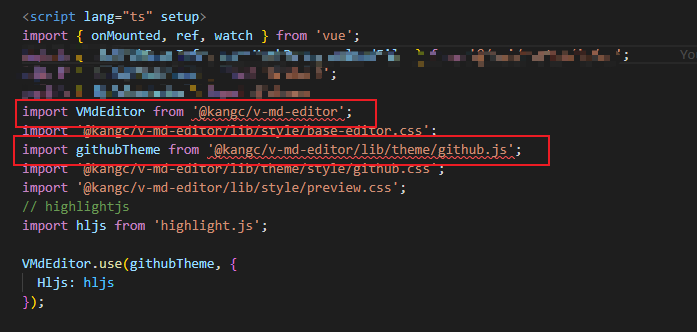
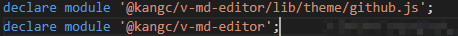
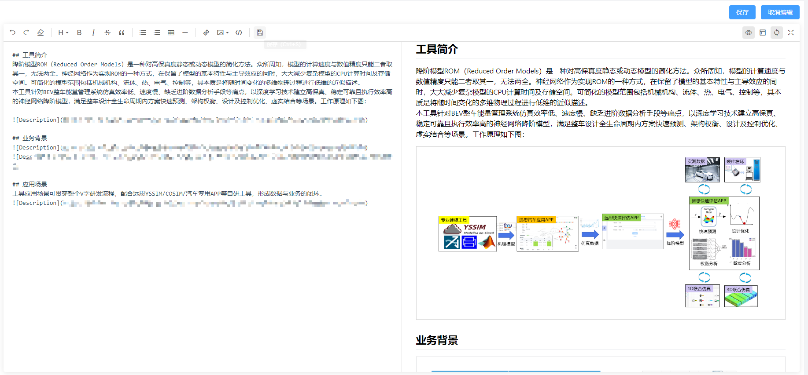
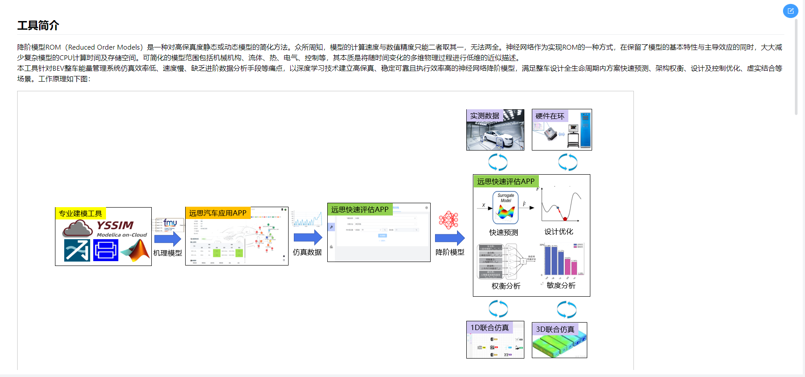
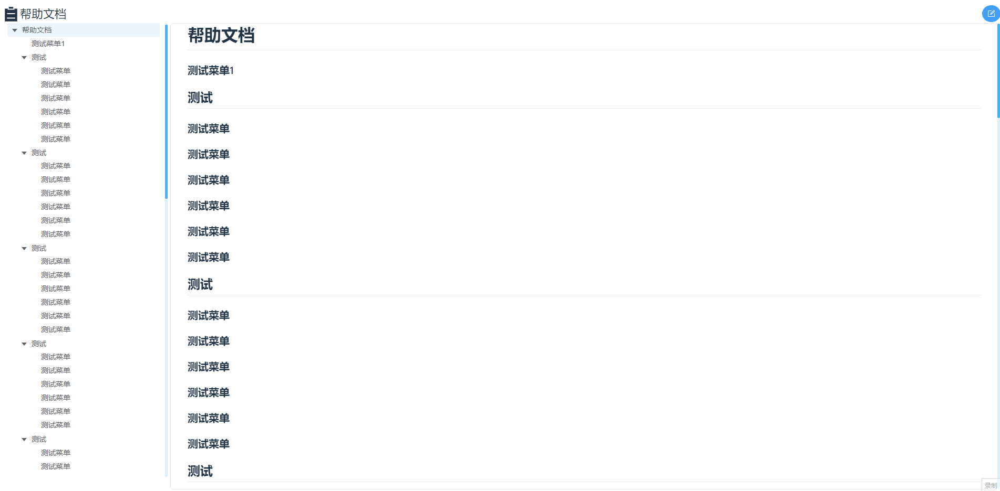

# v-md-editor ([官网地址](http://ckang1229.gitee.io/vue-markdown-editor/zh/quick-start.html))

## 安装支持 vue3 的版本
```js
npm i @kangc/v-md-editor@next -S
```

## TS中会出现的问题
1. 引入报错

`解决方法`: 在全局文件.d.ts中引入

## 使用完整代码（不带目录）vue3 + TS
`效果图（编辑）` 
`效果图（显示）` 
```js
<template>
  <div class="md-content">
    <div v-if="isEdit" class="save-button">
      <el-button v-if="isEdit" type="primary" @click="saveMk(text)"
        >保存</el-button
      >
      <el-button type="primary" @click="editDetail(false)">取消编辑</el-button>
    </div>
    <div v-else class="edit-btn">
      <el-button
        type="primary"
        circle
        title="修改文档"
        width="23"
        height="23"
        @click="editDetail(true)"
      >
        <i-ep-edit />
      </el-button>
    </div>
    <v-md-editor
      v-if="isEdit"
      v-model="text"
      :disabled-menus="[]"
      @upload-image="handleUploadImage"
      @save="saveMk"
    />
    <v-md-editor v-if="!isEdit" :model-value="markdown" mode="preview" />
  </div>
</template>

<script lang="ts" setup>
import { onMounted, ref, watch } from 'vue';
import { GetMarkDownInfo, saveMarkDown, uploadFile } from '@/api/system/index';
import { useSystemStore } from '@/store';
import { MarkDownName } from '@/enums';
import VMdEditor from '@kangc/v-md-editor';
import '@kangc/v-md-editor/lib/style/base-editor.css';
import githubTheme from '@kangc/v-md-editor/lib/theme/github.js';
import '@kangc/v-md-editor/lib/theme/style/github.css';
import '@kangc/v-md-editor/lib/style/preview.css';
// highlightjs
import hljs from 'highlight.js';

VMdEditor.use(githubTheme, {
  Hljs: hljs
});

type InsertImage = (imageConfig: Record<string, string>) => void;

const systemStore = useSystemStore();
const isEdit = ref<boolean>(false);
const markdown = ref<string>('');
const text = ref<string>('');

function editDetail(flag: boolean) {
  isEdit.value = flag;
  text.value = markdown.value;
}
function handleUploadImage(
  event: Event,
  insertImage: InsertImage,
  files: File[]
) {
  const origin = location.origin,
    basepath = '/gq-api';
  // 拿到 files 之后上传到文件服务器，然后向编辑框中插入对应的内容
  const form = new FormData();
  // 文件对象
  form.append('multipartFile', files[0]);
  uploadFile(form).then(res => {
    insertImage({
      url: `${origin + basepath}/gqInfo/downloadFile?id=${res.data}`
    });
  });
}
function saveMk(content: string) {
  saveMarkDown({
    id: systemStore.markdownId,
    content
  }).then(res => {
    if (res.code === 200) {
      ElMessage({
        message: '保存成功',
        type: 'success'
      });
      markdown.value = content;
      text.value = content;
      isEdit.value = false;
    } else {
      ElMessage({
        message: '保存失败',
        type: 'error'
      });
    }
  });
}
function GetMarkDown() {
  const id = systemStore.markdownId
    ? systemStore.markdownId
    : MarkDownName.TOOL_INTRODUCTION_ID;
  GetMarkDownInfo(id).then(res => {
    if (res.code === 200) {
      markdown.value = res.data.content;
      text.value = res.data.content;
    }
  });
}

watch(
  () => systemStore.markdownId,
  () => {
    GetMarkDown();
  }
);

onMounted(() => {
  GetMarkDown();
});
</script>

<style lang="scss" scoped>
.md-content {
  position: relative;
  margin: 10px;
  padding: 10px;
  background: #fff;
}
.save-button {
  display: flex;
  float: right;
  margin: 0px 0px 10px 0;
}
.edit-btn {
  text-align: right;
}
:deep .v-md-editor.v-md-editor--preview {
  height: calc(100vh - 145px);
}
:deep .v-md-editor.v-md-editor--editable {
  height: calc(100vh - 155px);
}
:deep .github-markdown-body {
  padding: 0 32px;
}
</style>

```

## 使用完整代码（带目录）vue2
`效果图（显示）` 

```js
<template>
  <el-backtop v-show="showElBacktop" target=".article-content" :right="50" :bottom="50" :visibility-height="300" />
  <div class="md-content">
    <div v-if="isEdit" class="save-button">
      <el-button v-if="isEdit" type="primary" @click="saveMk(text)">保存</el-button>
      <el-button type="primary" @click="editDetail(false)">取消编辑</el-button>
    </div>
    <div v-else class="edit-btn">
      <span class="title">
        <el-icon size="34px">
          <List />
        </el-icon>帮助文档</span>
      <el-button v-if="isAdmin" type="primary" circle title="修改文档" width="23" height="23" @click="editDetail(true)">
        <i-ep-edit />
      </el-button>
    </div>
    <v-md-editor v-if="isEdit" v-model="text" :disabled-menus="[]" @upload-image="handleUploadImage" @save="saveMk" />
    <div v-if="!isEdit" class="articleView">
      <div class="article-wrapper">
        <div class="article-side">
          <div class="toc-tree" id="toc-tree">
            <el-tree :data="tocData" ref="menuTree" node-key="id" highlight-current @node-click="handleNodeClick"
              default-expand-all :expand-on-click-node="false">
            </el-tree>
          </div>
        </div>
        <div class="article-content" ref="articleContentRef">
          <v-md-editor :model-value="markdown" mode="preview" ref="preview"></v-md-editor>
        </div>
      </div>
    </div>
  </div>
</template>

<script>
import { upDataHelpDocument, addPic, getHelpDocument } from "../../api/dataManage.js";
import { List, Top } from '@element-plus/icons-vue';
import { debounce } from 'lodash'

export default {
  components: { List, Top },
  data() {
    return {
      isEdit: false,
      markdown: '',
      text: '',
      fileId: '',
      titles: [],
      tocData: [],
      currentNodeId: null,
      cachedTitleHeights: {}, // 记录高度
      debudanceResize: null,
      scrollTop: 0,
      isAdmin: false
    }
  },
  computed: {
    showElBacktop() {
      return this.scrollTop > 300
    }
  },
  methods: {
    editDetail(flag) {
      this.isEdit = flag;
      this.text = this.markdown;
    },
    handleUploadImage(
      event,
      insertImage,
      files
    ) {
      const origin = location.origin, basepath = '/api';
      // 拿到 files 之后上传到文件服务器，然后向编辑框中插入对应的内容
      const form = new FormData();
      // 文件对象
      form.append("file", files[0]);
      form.append("fileId", this.fileId);
      addPic(form).then(res => {
        insertImage({
          url:
            origin + basepath + '/dataManange/fmuFile/preview?fileId=' + res.msg,
        });
      })
    },
    saveMk(text) {
      const formData = new FormData()
      const textValue = text ? text : '&nbsp;';
      formData.append("fileId", this.fileId);
      formData.append("description", textValue);
      upDataHelpDocument(formData).then(res => {
        if (res.code === 200) {
          ElMessage({
            message: "保存成功",
            type: 'info',
          })
          this.markdown = text
          this.text = text
        }
        this.isEdit = false

        this.$nextTick(() => {
          this.makeToc()
        })
      })
    },
    GetMarkDown() {
      getHelpDocument().then(res => {
        if (res.code === 200) {
          this.markdown = res.data?.fileDescription;
          this.text = res.data?.fileDescription;
          this.fileId = res.data?.gridFsId || '648183984f57d809e3af4647'
          this.$nextTick(() => {
            this.makeToc()
          })
        }
      });
    },
    // 将一个集合的数据变成一个树形的数据结构
    toTree(data) {
      // 删除 所有 children,以防止多次调用
      data.forEach(function (item) {
        delete item.children;
      });

      // 将数据存储为 以 id 为 KEY 的 map 索引数据列
      var map = {};
      data.forEach(function (item) {
        map[item.id] = item;
      });
      var val = [];
      data.forEach(function (item) {
        // 以当前遍历项的pid,去map对象中找到索引的id
        var parent = map[item.p_id];
        // 好绕啊，如果找到索引，那么说明此项不在顶级当中,那么需要把此项添加到，他对应的父级中
        if (parent) {
          (parent.children || (parent.children = [])).push(item);
        } else {
          //如果没有在map中找到对应的索引ID,那么直接把 当前的item添加到 val结果集中，作为顶级
          val.push(item);
        }
      });
      return val;
    },
    /**
     * 生成目录
     * */
    makeToc() {
      // 定义参与目录生成的标签
      const tocTags = ["H1", "H2", "H3", "H4", "H5", "H6"];

      // 目录树结果
      const tocArr = [];
      // 获取所有标题标签
      const headDoms = Array.from(this.$refs.preview.$el.querySelector('.github-markdown-body').childNodes).filter(item => tocTags.includes(item.tagName));

      // 遍历标题标签
      headDoms.forEach((item, index, arr) => {
        // 给标题添加id
        item.id = `h-${index + 1}`;
        // 获取当前节点前面的节点
        let prevs = arr.filter((i, j) => j < index);
        // 过滤前面的节点为合理节点
        // 如 h3节点前  只能为 h1 h2 h3
        prevs = prevs.filter(i => tocTags.filter((i, j) => j <= tocTags.findIndex(i => i == item.tagName)).includes(i.tagName));
        // 对前面的节点进行排序，距离自身节点近的排在前面
        // 如 div > p > span > img  当前为img
        // 常规获取节点为 [div,p,span,img]
        // 排序后获取节点为 [img,span,p,div]
        prevs = prevs.sort((a, b) => -(a.id.replace('h-', '')) - b.id.replace('h-', ''));
        // 查询距离自身节点最近的不同于当前标签的节点
        const prev = prevs.find(i => i.tagName != item.tagName);
        this.maxum = Math.max(this.maxum, index + 1)
        tocArr.push({
          id: index + 1,// 抛出id
          tag: item.tagName,// 抛出标签名称
          label: item.innerText,// 抛出标题
          p_id: item.tagName == "H1" || prev == null ? 0 : Number(prev.id.replace("h-", '')),// 抛出父级id
        })
      })

      // 使用上述方法生成树 最后在el-tree的data中使用 tocData即可
      this.tocData = this.toTree(tocArr);
      /* 如：[{"id":1,"tag":"H2","label":"@Configuration注解介绍","p_id":0,"children":[{"id":2,"tag":"H3","label":"full模式和lite模式","p_id":1,"children":[{"id":3,"tag":"H4","label":"如何确定配置类是full模式或lite模式？","p_id":2},{"id":4,"tag":"H4","label":"full模式增强","p_id":2,"children":[{"id":5,"tag":"H5","label":"full模式增强实例","p_id":4}]}]}]}] */

      this.$nextTick(() => {
        let tocTree = document.getElementById('toc-tree')
        let articleWrapper = document.querySelector('.el-tree')
        let extraHeight = articleWrapper.offsetTop
        let articleHeight = articleWrapper.offsetHeight

        let that = this

        let nodeTotalNum = 0 // 节点总数量
        function getcachedTitleHeights(node) {
          if (node.id) {
            // {'h-1': 123, 'h-2': 607,  ...}
            that.cachedTitleHeights[`h-${node.id}`] = document.getElementById('h-' + node.id).offsetTop
            nodeTotalNum++
          }
          if (node.children && node.children.length > 0) {
            for (let index = 0; index < node.children.length; index++) {
              getcachedTitleHeights(node.children[index])
            }
          }
        }
        if (this.tocData && this.tocData.length > 0) {
          getcachedTitleHeights({ children: this.tocData })
        }
        this.$refs.articleContentRef.addEventListener('scroll', () => {
          let scrollTop = this.$refs.articleContentRef.scrollTop
          this.scrollTop = scrollTop;
          let foundIndex;
          for (let index = 1; index <= nodeTotalNum; index++) {
            if (scrollTop >= this.cachedTitleHeights[`h-${nodeTotalNum}`]) {
              foundIndex = nodeTotalNum
            } else if (scrollTop <= this.cachedTitleHeights[`h-${index}`]
              && scrollTop >= this.cachedTitleHeights[`h-${index - 1}`]) {
              foundIndex = index - 1
              break;
            }
          }
          if (this.$refs.menuTree && foundIndex) {
            this.debudanceResize(foundIndex)
            this.$refs.menuTree.setCurrentKey(foundIndex)
          }
        })
      })
    },
    jumpTreeIndex(index) {
      document.querySelector(`[data-key="${index}"]`).scrollIntoView({ 'behavior': 'smooth' })
    },
    handleNodeClick(data) {
      // 平滑滚动
      document.getElementById(`h-${data.id}`).scrollIntoView({ 'behavior': 'smooth' })
      this.$refs.menuTree.setCurrentKey(null)
    },
    handleAnchorClick(anchor) {
      const { preview } = this.$refs;
      const { lineIndex } = anchor;

      const heading = preview.$el.querySelector(`[data-v-md-line="${lineIndex}"]`);

      if (heading) {
        preview.scrollToTarget({
          target: heading,
          scrollContainer: window,
          behavior: 'smooth',
          top: 0,
        });
      }
    }
  },
  mounted() {
    this.GetMarkDown();
    this.debudanceResize = debounce(this.jumpTreeIndex, 20);
    this.isAdmin = localStorage.getItem('userName') === 'admin'
  }
}
</script>

<style lang="less" scoped>
.md-content {
  position: relative;
  padding: 10px;
  background: #fff;
}

.save-button {
  display: flex;
  float: right;
  margin: 0px 0px 10px 0;
}

.edit-btn {
  display: flex;
  justify-content: space-between;

  .title {
    display: flex;
    align-items: center;
    font-size: 22px;
  }
}

:deep .v-md-editor.v-md-editor--editable {
  height: calc(100vh - 65px);
}

:deep .github-markdown-body {
  padding: 0 32px;
}

/* 整个滚动条 */
::-webkit-scrollbar {
  width: 5px;
  height: 5px;
}

/* 滚动条上的滚动滑块,参考： 滚动条样式修改->https://blog.csdn.net/coder_jxd/article/details/124213962 */
::-webkit-scrollbar-thumb {
  background-color: #49b1f5;
  border-radius: 32px;
}

/* 添加行号插件后，它默认把滚动条给覆盖了，所以将padding-left改成margin-left */
[class*=v-md-prism-] {
  margin-left: 72px !important;
  padding-left: 0 !important;
}

/* 滚动条样式，参考： */
/* 滚动条轨道 */
::-webkit-scrollbar-track {
  background-color: #dbeffd;
  border-radius: 32px;
}

.articleView {
  display: flex;
}

.el-tree-node:focus>.el-tree-node__content {}

.el-tree-node:focus>.el-tree-node__content {
  background-color: #eee;
  color: #606266;
}


.el-tree--highlight-current .el-tree-node.is-focusable>.el-tree-node__content {
  background-color: transparent;
  border-radius: 5px;
  color: #606266;
}

.el-tree--highlight-current .el-tree-node.is-current>.el-tree-node__content {
  background-color: #49b1f5;
  border-radius: 5px;
  color: #fff;
}

.el-tree-node__content:hover,
.el-upload-list__item:hover {
  background-color: #fff;
}

@keyframes launch {
  0% {}

  100% {
    background-position: -600px;
  }
}

.article-wrapper {
  width: 100%;

  position: relative;

  .article-content {
    height: calc(100vh - 60px);
    margin-left: 320px;
    border-radius: 6px;
    overflow: hidden;
    overflow-y: auto;
    border: 1px solid #e9e9eb;
  }

  .article-side {
    width: 295px;
    box-sizing: border-box;
    position: absolute;
    left: 0;
    top: 0;

    .article-anchor {
      width: 310px;
      padding: 10px;
      background: #fff;
      border-radius: 6px;
      transition: all 0.28s;

      &>div {
        text-overflow: ellipsis;
        white-space: nowrap;
        overflow: hidden;
      }

      a {
        color: #3eaf7c;
      }
    }

    .toc-tree {
      padding: 10px;
      background: #fff;
      border-radius: 6px;
      max-height: calc(100vh - 102px);
      overflow-y: auto;
      width: inherit;
    }
  }


}
</style>

```